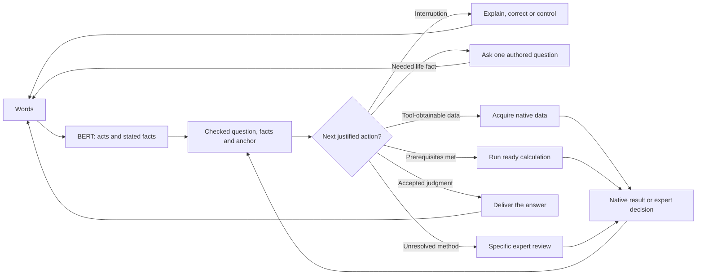
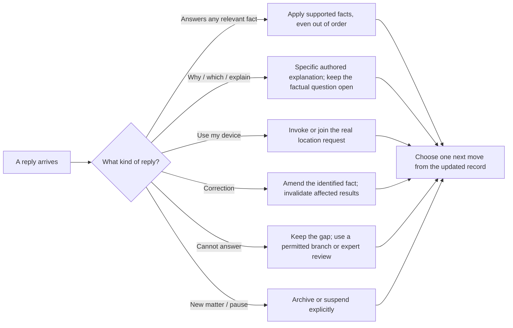
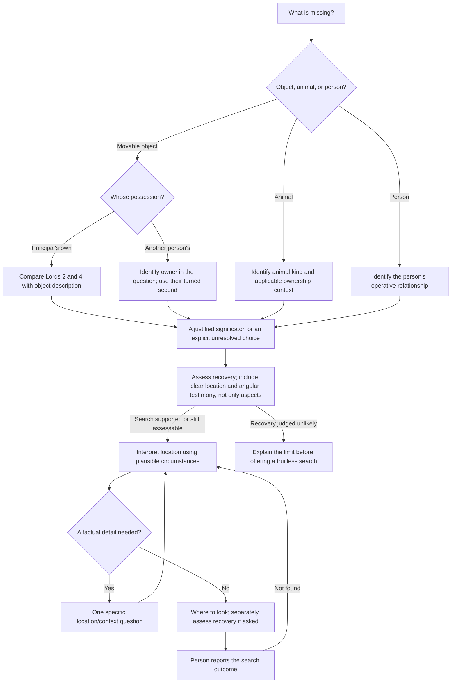
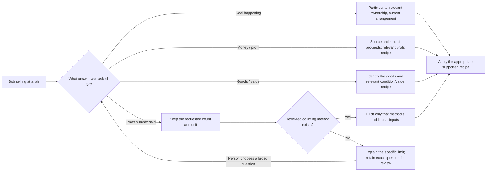
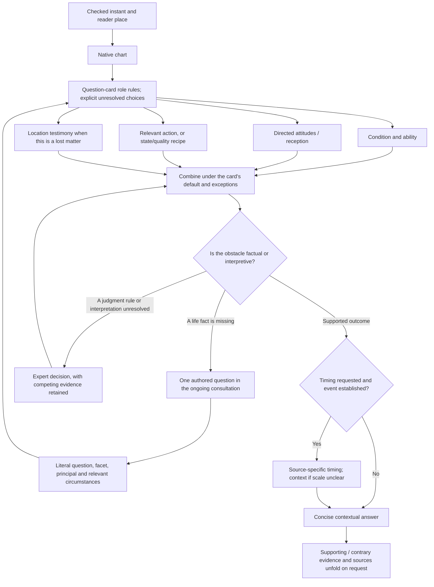

# A small, book-led horary conversation

**Design for Eileen's review · 6 October 2026 · proposed, not deployed**

This design separates two jobs: conducting the consultation, and judging the chart. The consultation is a conversation with one person, not a procession of specialist bots. Its machinery is a fact record, a catalogue of question-specific requirements, native tools, and a bank of authored sentences. BERT recognises a narrow set of meanings and proposes facts; it neither invents the interview nor makes astrological judgments.

The target is a complete elicitation protocol for the question families described below, including interruptions, corrections, tool failures, and further questions arising during judgment. This is a design specification. No BERT heads have been trained or evaluated; the worked conversations are authored examples. It does not establish that arbitrary horary interpretation can be reduced to classification, or that the existing app implements this protocol.

The underlying method is **John Frawley, The Horary Textbook (2005)**. Page references throughout are **printed pages**, not PDF/OCR pages. The locally supplied OCR places printed page 7 under `## Page 16`: the offset is nine. Selected quotations are brief; explanations, dialogue, software policies, and examples are newly authored. “According to the book” denotes method fidelity, not evidence that the predictions are empirically reliable.

## 1. What we are actually trying to obtain

A chart calculation needs remarkably little: an instant and coordinates. A useful reading additionally needs a sufficiently understood question and the circumstances that determine what its symbols mean. These are different readiness conditions.

| Information | Needed when | How to obtain it | What must not be substituted |
|---|---|---|---|
| The question, in the person's actual words | Every consultation | Preserve the utterance; classify the requested answer separately | A generated summary that quietly changes a number, negation, subject, or goal |
| Who is genuinely asking | Every consultation; usually already clear | Default to the speaker for a direct question; clarify an ambiguous relay | The person named in the question, or the person operating the keyboard, automatically |
| The matter and requested facet | Every consultation | Known question frames; a short choice if ambiguous | Treating “how many?” as “will any sell?” |
| The moment of understanding | Every new matter | Native receipt clock and the explicit convention below; accept a deliberate earlier self-question moment | The fair's start time; birth time; the end of a slow computation |
| The reader's place at that moment | Every chart | Device coordinates first, or an explicit reader-place override | The subject's address, remote client's address, or event venue |
| Operative capacity of the person or thing | If it affects the significator | Extract an explicit relationship/role; ask only if absent | Inferring ownership from “Bob is selling”; gender from a name; a house from a keyword alone |
| What is already true or arranged | If it changes the default outcome or relevant method | Stated circumstances; one targeted clarification if material | Assuming every question needs a new event to occur |
| The context specific to this question | Only the selected question card's actual requirements | Conversation; then chart-triggered questions if needed | A universal demographic/ownership/location/time questionnaire |
| The relevant chart facts | After a usable anchor exists | Native calculation and verified method tables | Asking the person to supply planets, receptions, or chart data the app can compute |
| A justified interpretation | After the applicable judgment requirements are satisfied | Authored method recipes plus explicit expert decisions where necessary | Declaring success because a chart or a long technical worksheet appeared |

The requirement is “know which relationship is operative,” not “collect everybody's full biography.” Names are convenient labels, not universally required inputs. An event's exact address or time is collected only if it has a job in the selected method: a weather question may need its target locality and season; an ordinary sale question does not need the venue geocoded just to cast a horary chart.

### The book's non-negotiable distinctions

1. **Understand the actual question.** Frawley calls this perhaps the most important work before casting (pp. 137–138). Ask again if its core meaning remains unclear (p. 14). Classification must preserve the actual requested facet.
2. **Distinguish a question about another person from that person's relayed question.** Erika asking through a translator receives the first house; someone's own question about their friend Erika uses the friend's house (pp. 137–138).
3. **Anchor the chart to understanding, at the reader's place.** A genuinely unclear core anchors when clarified. A reasonable initial understanding later found faulty keeps the initial chart (pp. 7–8).
4. **Keep the same chart for supplementary questions on the same matter.** A new issue normally starts a new chart (p. 8). Frawley also permits a few genuinely pressing separate issues in one chart if necessary (p. 140); the software's default of one matter per leaf is an editorial simplification, not a universal prohibition from the book.
5. **Assign by the capacity relevant to the question.** A car as a vehicle is different from the same car as a saleable possession (pp. 142–143). Relationship, ownership, and turning are contextual rules, not a single “person → house” lookup.
6. **Know the default option.** A hoped-for marriage and a wedding already scheduled have different baselines (p. 140). The interview must obtain this distinction when the question does not already supply it.
7. **Continue talking when the chart raises a factual question.** Frawley explicitly permits asking who an important planet might represent or who is involved (p. 14); this is not failure of the initial interview.
8. **Explain enough, then stop.** Be courteous, direct, and honest about uncertainty. Do not fill a consultation with counseling or technical display merely to make it feel substantial (pp. 243–246).

## 2. The smallest controller

There is no “current specialist actor.” There is one consultation record. After each utterance or tool result, the controller asks: **What can we now do, and what is the next indispensable unanswered question?**

Its lifecycle has only **open, paused, and archived** modes. “Waiting for location,” “asking about ownership,” and “ready to calculate” are consequences of the record, not mutually exclusive global stages. A chart and an unanswered contextual question can coexist. An unanswered question cannot turn into a completed interpretation.

These boxes are possible actions, **not stages that must be completed in order**. The guards in §6 prevent chart work before core understanding and scope acceptance, and interpretation before its particular requirements are met. If a tool or human answer is pending, preserve it and wait; a wait does not count as an answer or completion.

The independent effects share the record and can discover separate requirements. They do **not** independently talk to the person. A single planner selects the next conversational move. Native location acquisition and remaining context checks can run together; an absolute UTC moment does not wait for geocoding. Resolving a historical civil time does depend on its time zone. Judgment computations may run together when their inputs genuinely do not depend on one another.

### One record, with explicit scopes

The record contains:

- Original utterances and their receipt instants; an explicit principal/relay relationship.
- The literal question, recognised family, requested facet, and any explicitly requested horizon or quantity. Uncertainty is retained as uncertainty.
- Reported circumstances: participants in their operative roles, ownership, existing arrangements, options, locations and event dates. A report or belief is not promoted to a verified fact.
- A separate chart anchor: reader identity, reader coordinates at the anchor, UTC instant, accuracy/provenance, and the editorial convention used to select it.
- One outstanding human question, identified by its response-bank ID and the requirement it addresses. Several facts can be volunteered in one reply.
- Native tool requests and outcomes; chart and method results bound to the facts they actually depend on; corrections and previous versions.

`reader_place`, `event_place`, `last_seen_place`, and `person_home` are different fields. So are `chart_moment`, `event_time`, and `last_seen_time`. The sentence “The fair is in Bozeman tomorrow at three” proposes event context; it does not overwrite the chart anchor. If its scope is genuinely unclear, the controller asks which it is.

An absent field in a later classifier result means **no change**. It never erases earlier facts. Contradictory unmarked statements create a clarification; an explicit correction replaces the selected fact, preserving its earlier value and source. Corrections invalidate only the affected chart/method results. “The fair is in Billings instead” does not recast the chart; “Use the reader's earlier location in Billings” may.

### Where software needs an explicit convention

The book describes a human astrologer's understanding. It does not define a timestamp for BERT, a device acting as reader, or an automated app. Proposed convention for Eileen's assessment:

- In a direct consultation, the app acts as reader where this device is. For a human using it to assist a remote consultation, the operator's reader place is used; a remote client's location remains context.
- When a recognised utterance first makes the core matter sufficiently clear, use **that utterance's receipt instant**, rather than inference completion. For speech, retain the audio-end time as well as transcription receipt; use the audio-end time for this convention. This avoids adding computation latency to the chart's time. It is a software convention, not a quotation from Frawley.
- If the original matter was genuinely unintelligible, use the clarification utterance's instant. If it was reasonably understood and later corrected, preserve its initial instant, as the book says. The difference must be visible in the receipt and correctable by the astrologer.
- In self-question mode, submission normally expresses the decision to cast. “I decided to ask at 2:15 this morning” is an explicit earlier decision moment; do not confuse it with “I first worried about this last week” (p. 8).
- A missing ownership detail, device-location permission, or later contextual question does not by itself move an already understood question's instant.
- Bind location to that same moment. Reuse a suitably fresh fix; if the device has moved, or an earlier moment is requested, do not silently use a current fix for an old place. Ask only when this is a real ambiguity.

The native calculation accepts UTC plus coordinates. It does **not** require a matching nearby city name or the device's display time zone. Human civil-time input does require a known zone; daylight-saving gaps and repeated times receive specific clarifications. A coordinate fix has an accuracy estimate. If its uncertainty materially changes the rising sign or a needed cusp, improve the fix or preserve that uncertainty for review; do not reject a chart merely because the Ascendant is early or late (pp. 140–141).

## 3. What BERT may do

[BERT's original 2018 paper](https://arxiv.org/abs/1810.04805v1) supports the intended engineering model: a text encoder with small task heads. Here it supplies recognisers, not a conversational mind. Typed input works without any speech model. Voice can use platform dictation as a separate front end; BERT itself does not decode audio, and no Gemma transcription or generative response is required for this design.

| Recogniser | Output | Examples | Authority it does not have |
|---|---|---|---|
| Dialogue act | Provide facts; ask why/which; request device lookup; correct; explain; continue; new matter; pause; unknown/refuse | “Which place do you mean?” → location explanation; “Ask my device” → location effect | Turning a meta-question into the answer to the pending factual question |
| Question frame and facet | One of the authored cards; event/status/quality/motive/location/recovery/timing/amount/count/choice | “How many tulips?” → sales + count; “Will I be paid?” → payment + arrival | Rewriting an unsupported question into an easier one |
| Entity and scoped slot extraction | Text spans for people, relationships, roles, possessors, places, times, quantity, negation and existing arrangements | “Bob sells my flowers” → seller Bob; owner speaker; “Bozeman is the fair” → event place | Assuming Bob owns them, guessing coordinates, or deciding which planet is Bob |
| Supported relation/frame resolution | A candidate binding within the current question, plus confidence | “He is my brother” while Bob is the only unresolved person → Bob's relation | Resolving “he” silently when two plausible people are active |

Use the current utterance, the literal question, the outstanding question ID, and a compact set of relevant known entities. Do not give every recogniser the full history, all horary rules, or every teaching passage. The heads can share one encoder pass where appropriate. Train on authored contrastive examples and annotated real consultations; choose confidence/margin thresholds from held-out data, not an invented universal “90% is safe” number. An out-of-catalogue or conflicting recognition abstains.

Native parsers perform calendar arithmetic, house turning, geocoding, and numeric validation. A recogniser can label “Friday” as an event-date span. It does not decide the Gregorian date, daylight-saving occurrence, or symbolic timing unit.

### Contrastive cases the recognisers must distinguish

| Person says | Accepted meaning | Forbidden inference |
|---|---|---|
| “Bob asked me to put his question to you.” | Relay candidate; clarify only if needed | Speaker is automatically querent |
| “I'm wondering whether my friend Bob will sell his books.” | Speaker's own question; Bob is friend and owner | Bob is querent |
| “Bob will be selling the tulips.” | Bob is seller | Bob is owner |
| “He doesn't own the tulips; I do.” | Explicit ownership correction | Drop the negation |
| “Where am I asking from, or where is the fair?” | Meta-question about location scope | The word “fair” is a location answer |
| “You should be able to ask my device.” | Device-location request | Ask the same city question again without a tool call |
| “The fair is tomorrow at three.” | Event-time report | Recast for tomorrow at three |
| “I decided to cast this morning at three.” | Candidate self-question anchor override | Treat it as the event time |
| “Should I take the job?” | Assess an available option; verify availability if unclear | The same recipe as “Will I get the job?” |
| “How much will I earn?” | Amount/quality facet | Require an arrival aspect for every amount judgment |
| “Will my friend and I become partners?” | Clarify romantic versus business partnership if ambiguous | Infer romance from “partner” alone |
| “What about my daughter?” | Ambiguous follow-up | Invent the daughter-related question |

High confidence does not prove semantic correctness. Keep the recognised question and critical facts visible in normal prose, allow ordinary corrections, and test the resulting fact state—not just the classification label or a valid serialization. No output-format experiment with JSON/XML changes this division of responsibility: BERT returns typed labels/spans; it does not generate a tool-call document.

## 4. The authored response bank

Every row is a conversational move, not a compulsory step. Its guard must be true before it can be asked. Curly-braced substitutions come from validated facts or an authored option list, never arbitrary diagnostic text. Each row has a normal wording and a short explanation available when the person asks “why?” The bank is intentionally small and expandable by Eileen.

### Universal and anchor moves

| ID | Guard / purpose | Exact normal wording | What satisfies it / next action |
|---|---|---|---|
| `WELCOME` | No current matter | “What would you like to know?” | Any recognised question; otherwise `CORE` |
| `CORE` | Cannot identify the requested issue | “What would you like me to find out about {stated subject}?” | An actual question/facet; do not cast before it is understood |
| `FACET` | Two materially different supported readings | “Are you asking {authored option A}, or {authored option B}?” | Explicit choice; unrelated reply does not complete it |
| `PRINCIPAL` | Genuine ambiguity about a relay | “Is this your question about {person}, or are you passing on their own question?” | Own versus relayed question; bind principal |
| `MATTER` | New issue versus same-matter supplement unclear | “Is this part of the question about {matter}, or would you like a fresh reading?” | Same matter preserves anchor; fresh reading creates a separate record |
| `LOCATION_LOOKUP` | Device place actually being requested | “I'll check this device's location.” | Emit a real identified native request; do not merely say this |
| `LOCATION_WHY` | Asked which location or why | “For the chart I need where I'm reading your question—normally this device. The event's location is part of the situation.” | Resume the same outstanding requirement; perform lookup if untried |
| `LOCATION_FAILED` | Device lookup ended without usable coordinates and no override exists | “I couldn't get this device's location. Which town should I use for the reader's place?” | Native geocoding, not model-guessed coordinates |
| `LOCATION_DENIED` | Native tool specifically reports denied permission | “Location access is off. Which town should I use for the reader's place?” | Accept town or an explicit request to try device lookup again |
| `LOCATION_SCOPE` | A supplied place could mean reader or subject/event | “Is {place} where you're reading this with me, or where {event} happens?” | Bind only the selected scope |
| `PLACE_CHOICE` | Geocoder returns materially distinct candidates | “Do you mean {candidate A} or {candidate B}?” | Select a displayed candidate; preserve candidate IDs internally |
| `PLACE_REGION` | More than two useful candidates, or no useful match | “Which state or country is {place} in?” | Refine the same lookup; never silently choose the first result |
| `MOMENT_WHY` | Asked why event time is not chart time | “This chart uses when your question became clear here. {event}'s date helps describe the question; it doesn't set this chart's time.” | No changed anchor; retain any new event context |
| `EARLIER_MOMENT` | Explicit earlier reader/self-question moment is incomplete | Self-question: “What date and time did you decide to cast the question?” Remote consultation: “What date and time did you understand their question?” | Complete civil time plus its place/zone; not date of first worry or when a remote client wrote it |
| `EARLIER_DATE` | Only the earlier anchor date is missing | “Which date was that?” | Retain the already supplied time; no repeated full date/time interview |
| `EARLIER_TIME` | Only the earlier anchor time is missing | “What time was that?” | Retain the already supplied date |
| `TIME_PERIOD` | An earlier civil time needs morning/evening disambiguation | “Do you mean {time A} in the morning, or {time B} in the afternoon/evening?” | Select the actual period; do not infer it from the current clock |
| `EARLIER_PLACE` | Reader's place at an earlier anchor is unknown | “Where were you when you {decided to cast it / understood their question}?” | Resolve the earlier reader place; current device fix alone does not suffice |
| `TIME_OCCURRENCE` | Native resolver reports a repeated civil time | “The clocks repeated {time} there. Was this before or after they went back?” | Earlier versus later occurrence |
| `TIME_GAP` | Native resolver reports a nonexistent civil time | “The clocks skipped {time} there. What time should I use instead?” | A real corrected time; no auto-shift |
| `TIME_SCOPE` | Date/time scope is genuinely ambiguous | “Is {time} when the event happens, or when you {decided to cast the question / understood their question}?” | Use the variant for the known consultation kind; bind the selected scope; otherwise keep it unresolved |
| `CORRECTION` | A correction's target is ambiguous | “Would you like to change {fact A} or {fact B}?” | Identified target; exact earlier values remain in history |
| `UNKNOWN` | Person cannot/will not provide a material fact | “We can leave that open. It limits what I can conclude about {specific point}.” | Preserve unresolved status; branch if the method permits, otherwise expert review; never pretend the fact was obtained |

Normal current-time/device-place cases ask **none** of the anchor questions. Location failure is shown as the failure actually returned: a timeout is not described as denied permission. Retry requests work even after a prior failure; the first lookup is not a permanently memoised failure.

### Context moves selected by the question cards

| ID | Missing fact | Exact normal wording | Book basis |
|---|---|---|---|
| `RELATION` | Operative relationship of a named third person | “Who is {person} to you?” | Houses in context, pp. 15–29; asking who is involved, p. 14 |
| `CAPACITY` | Two roles would lead to different assignments | “Are you asking about {person} as your {role A}, or as {role B}?” | Capacity relevant to the question, p. 26 |
| `OWNER` | Whose movable possession it is | “Whose {object} are they?” / singular equivalent | Lost ownership, pp. 146–147; other sales, p. 172 |
| `ROMANCE_STATE` | Current/planned versus hoped-for relationship | “Is there already a relationship or wedding planned, or are you asking whether one will begin?” | Default option, p. 140; relationship questions, pp. 191–194 |
| `PARTNER_TARGET` | More than one plausible partner is named | “Which person is your question about?” | Give the seventh to the person specifically asked about, p. 192 |
| `ROLE_DESCRIPTION` | A relevant unassigned actor needs distinguishing | “Could you briefly describe {person A} and {person B} so I can tell them apart?” | Candidates, p. 190; comparing doctors, p. 189; ask who matters, p. 14 |
| `LOST_KIND` | Unclear if object, person or animal | “What is missing?” | Different significators, pp. 146–147 |
| `OBJECT_DESCRIPTION` | Own-object Lords 2/4 need comparison | “What is {object} like—its material, colour and shape?” | Select the ruler whose description fits, pp. 146–148 |
| `POSSIBLE_PLACES` | Needed to interpret a location signature | “Where might it have been—at home, at work, or somewhere you visited?” | Plausible locations and circumstances, pp. 149–153 |
| `PEOPLE_INVOLVED` | A chart-relevant role needs factual identification | “Who else was involved in {specific part of the situation}?” | p. 14; this does not imply a thief or affair |
| `PAYMENT_SOURCE` | Source/capacity determines whose money | “Who would pay you: a client, an employer, or someone else?” | Money, wages and other sources, pp. 156–161 |
| `PAYMENT_BASIS` | Entitlement versus discretionary gift changes reception relevance | “Is this payment already owed to you, or is it a grant or gift someone has to choose to give?” | pp. 160–161 |
| `JOB_STATE` | Acquisition, continuation, return or assessment unclear | “Are you trying to get this job, keep it, return to it, or decide whether to take it?” | pp. 222–226 |
| `JOB_EXISTING` | Third-party new job versus existing career/boss distinction unresolved | “Is this a new job {person} is applying for, or the job they already have?” | p. 224 |
| `DEAL_PARTY` | Role of other party needed and not inferable | “Who would you be making the deal with?” | pp. 167–168; a named relative/friend can replace generic seventh |
| `DEAL_FACET` | Success versus merit of an available deal | “Are you asking whether the deal will happen, or whether it's a good deal to take?” | pp. 167–172 |
| `OPTIONS` | A comparison has no finite alternatives | “What are the options you're choosing between?” | Stay/go, pp. 201–203; hiring shortlist, p. 190 |
| `HOME_MEANING` | “Home” has two materially different meanings in relocation | “Which do you call home: where you live now, or the place you're thinking of returning to?” | Explicitly called for on p. 203 |
| `SUPPORT` | Contest has no established affiliation | “Which side are you supporting, or hoping will lose?” | Us/them requires preference, pp. 203–204 |
| `CONTEST_GOAL` | Winning versus bet profit unclear | “Are you asking who wins, or whether your bet will pay?” | p. 203 |
| `MESSAGE_TARGET` | Person's contact versus parcel arrival unclear | “Are you waiting to hear from {person}, or for something they sent?” | pp. 165–166 |
| `PREGNANCY_FACET` | Existing pregnancy versus future conception unclear | “Are you asking whether there's a pregnancy now, or whether conception will happen?” | pp. 173–176; policy checked before proceeding |
| `ADOPTION_STATE` | Prospective adoption versus an already adopted child unclear | “Has the adoption happened, or are you asking whether it will?” | pp. 177–178 |
| `CUSTODY_STATE` | Entry versus continuation/release unknown | “Is {person} already in custody?” | Essential context stated on p. 234; policy checked first |
| `WEATHER_CONTEXT` | Target event/locality/season materially unresolved | “Where and when is {event}?” | Context qualifies weather, pp. 238–239; separate from chart place/time |
| `ELECTION_CONTEXT` | Office/incumbent/affiliation changes political mapping | “Which office and candidates do you mean, and are you asking as a supporter or an observer?” | pp. 212–214; subdivide if the reply only supplies part |
| `TIMING_CONTEXT` | Two plausible scales remain after event judgment | “For {event}, are you thinking in {scale A} or {scale B}?” | Plausible scale comes from context, pp. 127–133 |
| `ACTION_WINDOW` | Choosing when to act, with no usable window | “What dates are possible?” | Horary election under constraints, pp. 241–242 |
| `COUNT_LIMIT` | Exact count lacks a reviewed method | “You're asking for a number of {objects}. I don't yet have a reliable rule for that count. Would a broad assessment of the sale help, or should we keep the exact question for review?” | Editorial method-coverage limit; do not claim the book forbids all quantity questions |

The most specific guard wins. `RELATION` is not used when the frame already determines the appropriate capacity. `OBJECT_DESCRIPTION` is not required for another owner's object solely to choose between Lords 2 and 4; that rule applies to the querent's own lost object. `TIMING_CONTEXT` is not asked if a scale is already clear or if the event is not established. Every normal question offers one coherent conversational purpose; known information is omitted.

### Brief social and control moves

| ID | Exact wording / behaviour |
|---|---|
| `ACK` | “That helps.” Optional; usually omit it when the next useful sentence is sufficient. |
| `QUESTION_RECEIPT` | “I'll look at {faithful, supported question paraphrase}.” Use an authored frame with retained quantity/negation; omit if no safe frame exists. |
| `CONTEXT_WHY` | An explanation selected by requirement: e.g. “Whose flowers they are changes which part of the chart describes them.” |
| `CHART_READY` | “The chart is here. I'm still checking {actual unresolved context} before judging it.” Only when a chart really exists and context really remains. |
| `WORKING` | Quiet document progress showing the real operation; e.g. “Comparing the two possible object rulers.” No fabricated emotional contemplation or endless repeated filler. |
| `UNRECOGNISED` | “I didn't understand that part. {specific existing question, with an example if useful}” No “lost my place” and no erasure. |
| `HEARD_UNCERTAIN` | “Did you say {candidate A} or {candidate B}?” Only for a material transcription ambiguity; never ask the person to re-record an entire reading unnecessarily. |
| `PAUSE` | “We'll keep this here.” Suspend effects that can be cancelled; retain unfinished work. |
| `CONTINUE` | Resume the current unmet requirement or computation; do not generate a new question or time. |
| `FRESH` | “A fresh page. What would you like to know?” Archive the old case; clear its active dialogue context and pending questions. |
| `REVISIT` | “Let's revisit that part of this chart.” Available only when the retained chart/result exists; otherwise say the specific work is unfinished. |
| `METHOD_UNRESOLVED` | “I can keep the chart and what we've established, but this part needs the astrologer's judgment: {specific unresolved point}.” No request for the user's chart data. |

Warmth is in attentive, specific sentences and dependable behaviour. If the person asks about the method, use a short authored explanation and make the source passage available. Do not insert a lesson at every turn. Lightness can come from the unfolding chart/document; a serious or distressed question should not receive a playful canned joke. Social style cannot change the selected facts, testimony, or judgment.

The social controller is an **interrupt policy**, not another domain pipeline:

An interruption can also contain facts. “Why do you need the fair's time? It is tomorrow at three” retains the event-time span **and** answers the meta-question. Merely answering “why?” never fulfils the still-missing location or ownership requirement.

## 5. Question cards: the actual horary interview

A card is a small authored recipe with: recognised frames; requested facets; genuinely required context; conditional questions; role assignments and exceptions; relevant native calculations; possible further factual requirements; supported answer types; and printed source pages. Requirements are predicates over facts, not a list of questions to ask regardless of what was already said.

Before publishing a chart or promising an answer, check the configured service policy and method coverage. Accept a supported reading, an explicitly described expert-review case, or explain the scope immediately. Frawley asks the astrologer to decide difficult-question policy before accepting the question (pp. 245–246). He does not supply a universal ban on third-party, important, or trivial questions. Coverage gaps and service policies must be labelled as ours.

### A. Relationship

**Recognise:** beginning, continuation, ending, suitability, feelings/motives, or future partner. These are different facets of one family.

**Get only what is missing:** the genuine principal; the person specifically asked about if there are several; whether this is an actual/planned relationship or a hoped-for one when the baseline is material. Do not require a birth date, birth place, address, partner's surname, or gender just to cast and use house rulers.

**Assign:** principal's first-house ruler and normally Moon; seventh for the partner/prospective partner, even if currently a friend or not yet met. A question specifically about a neighbour's feelings can instead use that person's third-house role. Give the seventh to the person specifically asked about, not automatically the spouse mentioned first (pp. 191–192).

**Natural co-significators:** the book's Sun/man and Venus/woman rule is confined to these questions, secondary to house claims, and not assigned arbitrarily between same-sex partners. A name or voice never establishes these roles. If Eileen wants this part of the traditional recipe, its roles must be explicitly known or clarified when the method needs them. Otherwise mark that testimony as unavailable and its consequence as needing review; do not claim omission is Frawley's complete recipe. No mandatory gender questionnaire for everyone.

**Judgment-specific re-entry:** if another planet is materially involved, ask who is in the relevant circumstances; do not invent a lover or rival. Receptions address motives; event-oriented questions also examine ways the event could occur. “Does X love me?” does not automatically demand a new event aspect (pp. 193–194).

### B. Lost object, animal or person

**Get only what is missing:** what is missing; whose an inanimate object is, or who the missing person is to the principal. For an animal, its kind determines the appropriate animal category. Dogs are sixth-house animals and horses twelfth-house animals by kind, not by measuring a Great Dane against a pony (pp. 146–147). Do not import the owner's-turned-second rule for objects into this animal rule or demand owner biography without an actual method need; the introductory neighbour's-cat example itself uses the sixth (pp. 1–3).

**Own lost movable object:** compare Lords 2 and 4 against the object's description. Ask material/colour/shape if the original words do not supply enough. This choice is a chart-dependent matching task; a recogniser must not arbitrarily pick a planet.

**Another person's object:** use that owner's turned second house. A daughter's watch is second from fifth, hence sixth; do not also impose the own-object second/fourth contest. A missing person uses the appropriate relationship house (pp. 146–147).

**Get later, if useful:** possible places and people involved, distinctive features of the relevant room/place, whether a suggested location was actually searched. “It can't be there” is a report about the search, not infallible proof. Keep plausible interpretations available (pp. 149–153).

**Do not ask routinely:** thief's name, theft suspicions, everybody's address, exact loss time, indoor compass measurements. Do not introduce theft unless the person raises it (p. 149). Lost-time/location facts are context, not chart-anchor replacements. An outdoor direction signature is not a precise indoor GPS instruction.

**Completion:** consider whether recovery is supported before promising a useful search; Frawley warns against describing a whereabouts when the object will not be found (p. 148). This is not an aspect-only gate: recovery can have other positive testimony, including an angular position or clear location. A void Moon is not an automatic veto on locating something that already exists (pp. 147–150). If the proposed location fails, return to this chart with that outcome; do not automatically cast a fresh one (p. 244).

### C. Sale, proceeds, or an exact count

**First preserve the requested answer:** selling at all, completing a particular deal, assessing goods/value, proceeds/profit, and the number sold are not interchangeable.

**For a supported movable-goods sale:** know the seller/principal relationship and whose goods they are, if needed for the assignment. Known named relatives/friends need their appropriate roles; “a customer” can be an ordinary counterparty. Ask `DEAL_PARTY` only when the method genuinely needs an unresolved other party. Movable goods are second-house possessions in the relevant capacity; goods contemplated for purchase can be treated as potential possessions (p. 172). Property is a different card.

**Do not collect by habit:** the fair's address, start time, every customer, stock count, cost basis, or an entire business plan. Collect a numerical threshold or stock cap only if the selected, reviewed question actually uses it. Keep a volunteered Friday or Bozeman as event context. It does not set the chart anchor.

**For “How many tulips will Bob sell?”:** store **count**, unit **tulips**, seller **Bob**, and the specified fair/horizon. Do not silently answer “Will Bob sell anything?” The reviewed source passages here do not establish a general algorithm converting testimony into an exact tulip count. Frawley does discuss coarse numbers in a specific childbirth method (p. 177); that is not a licence to transfer it to tulip sales. This count needs an Eileen-reviewed method contract, or explicit expert review. `COUNT_LIMIT` offers a genuinely different broad question only with the person's agreement.

**For proceeds:** whose money and what kind of profit matter. Sales receipts are not automatically wages; earning from knowledge or a voyage has its own ninth/tenth-house recipe (pp. 156–161, 216–219). If the original question does not discriminate two applicable recipes, ask the factual distinction; BERT does not choose by inventing the scenario.

### D. Money, payments and debt

**Distinguish:** amount/quality, arrival, timing of an established arrival, affordability/condition of one's money, repayment, gift/grant, gambling profit, investment, or legacy.

**Elicit:** payer/source/capacity if it changes whose money; whether payment is an entitlement or discretionary where that affects the recipe. The customer's money is normally eighth; the job/government's money eleventh. Money owed by a known relative follows that person's relevant house; one's shares are one's second-house property, not automatically eighth (pp. 156–161).

**Do not conflate:** a relevant contact supports money reaching the principal; absence of an arrival aspect does not automatically settle a question merely about amount or quality. Reception matters differently for an owed entitlement and a discretionary gift. Timing comes after establishing the arrival, and only asks for a scale if context does not already settle it.

### E. Jobs, career and people at work

**Distinguish first:** get a new job, keep a current job, return to an old job, assess an offered job, assess pay, or deal with a boss/co-worker/subordinate. “Should I take it?” is not “Will they offer it?”

**For one's new job:** first/Moon for the principal, tenth for the job. Involvement of wages does not itself establish getting the job (pp. 222–223). An explicitly stated agent/headhunter can make intermediary testimony relevant; the app must not require an intermediary biography in every job question.

**For someone else's new job:** identify that person; generally use the **radical tenth** for the external job. For their existing career, boss or current job, use their **turned tenth**. If the person is themselves tenth-house, the new-job case also needs the turned tenth (p. 224). This exception is why a generic turn-everything helper cannot own method selection.

**At work:** co-workers are seventh in their work capacity, not automatically eleventh even if friendly; subordinate employees sixth; a boss directly asked about tenth. If both job and boss are at issue, the boss's allocation needs the book's collision rules rather than giving both the same role blindly (pp. 224–225).

**Default:** keeping a job examines stability/disruption; assessing an available job examines its quality and relevant context. Neither is forced into the acquisition-aspect recipe. Returning to the same job has distinct re-entry testimony (pp. 225–226).

### F. Deal, property and rental

**Elicit:** deal occurrence versus whether an available deal is worthwhile; buyer/seller/tenant/landlord capacity; other party if it changes assignment. Ordinary opposing parties are first/seventh; a particular relative or friend can replace the generic seventh (pp. 167–168).

**Property:** fourth for property, tenth for price; do not use the movable-object card. Condition versus price can be assessed separately from concluding the deal. Profit from the property has its own role. Ask the person's priorities only when “good” remains genuinely underspecified—for example, home quality versus investment returns—not as a compulsory coaching exercise (pp. 167–171).

**Rental:** modern landlord/tenant agreements are first/seventh deals, not universally master/sixth-house servant relationships. An opposition that can be acceptable in a sale promises regret in the ongoing rental relationship (p. 170). A place bought or rented to work on/in has the book's business-property recipe (p. 171); do not apply ordinary house-price roles indiscriminately.

### G. Choice and relocation

**Elicit:** what continuing means; the actual proposed change; a finite shortlist where multiple options are being compared. Know whether “home” means current home or homeland if this changes fourth versus ninth (pp. 201–203).

**General stay/change:** first for things as they are, seventh for the changed situation. This is not automatically the counterpart's relationship role. A comparison between specific destinations such as work and college can instead use the corresponding houses. Do not mechanically place the principal into seventh to judge the ordinary stay/change case; the book explicitly warns against that (p. 202).

**Hiring among candidates:** require a shortlist, know the favoured candidate if applicable, and obtain brief distinguishing descriptions only when needed. The sixth-house employee recipe assumes the person can be hired, so it is not an obligatory acquisition-aspect question (pp. 189–190). Mapping descriptions to otherwise unassigned planets still requires a reviewed rule or expert choice.

### H. Contact, parcels and visitors

**Elicit:** contact with a person versus arrival of their letter/parcel, and the sender/visitor's capacity if unresolved. “When will the book arrive?” requires the seller's parcel; an aspect to the seller alone does not show arrival of that parcel. Once received, the item becomes one's possession (pp. 165–166).

For an expected visit, who is coming and the naturally limited scale usually suffice; do not insist on their full address or birth time. A plumber and a friend have different roles. A long-lost friend's possible return must not use the “already expected arrival” assumption (p. 166).

### I. Contest versus betting

**Elicit:** match/season/championship facet, the side supported or opposed, and whether the actual concern is the bet's profit. Us/them is not home/away or first-named/second-named. With no preference, the match recipe lacks a basis for assigning the two sides; retain this as a method limitation rather than inventing an affiliation (pp. 203–204).

Do not elicit fans, referee, every player and team balance sheet for an ordinary match. The Moon is not automatically the principal's usual co-significator here. Season/championship questions have different testimony from a single match (pp. 203–208).

### The rest of the book: explicit coverage, not a generic catch-all

These cards extend the same controller; they do not add global lifecycle states. Their **elicitation** is specified here. Their judgment recipes require separate source-bound implementation and qualification. Some parts of the book explicitly demand discretion or additional expertise.

| Card | Minimal conditional elicitation | Distinction that must survive | Source |
|---|---|---|---|
| Vehicle/journey safety | Identify the vehicle/journey and whose relevant undertaking it is; resolve safety versus sale | “Ship I sail in” first versus movable possession second; no need to be aboard when asking | pp. 142–143 |
| Description of a person | Identify the person and operative relationship; ask relevant known context only when needed | A comparative broad description, not invented exact height/tattoo/ethnicity | pp. 143–145 |
| Information true/false | The specific claim; determine whether it is really a relationship/job/etc. question | Ordinary underlying matter usually wins over superficial “is it true?” phrasing; prophecy uses ninth where appropriate | pp. 164–165 |
| Trustworthiness | Whom and in what capacity; clarify the actual concern if vague | Person's condition, not a generic information-veracity card | p. 165 |
| Current pregnancy | Whose pregnancy; relevant relationship/parenthood if needed | Present state versus future conception; turning depends on who asks; do not infer paternity from a name | pp. 173–174 |
| Conception/fertility | Whose question; near-term/treatment versus “ever”; relevant known life context for the default | Conception, carrying to term, and lifetime potential are distinct; no routine birthday collection | pp. 174–177 |
| Adoption | Prospective versus completed adoption; known birth-parent relationship if relevant | Someone else's child versus one's already adopted child | pp. 177–178 |
| Illness/treatment | Patient/capacity; diagnosis versus prognosis versus doctor/treatment comparison; current treatment if relevant | Medical horary does not simply label Lord 6 “the illness”; medical diagnosis exceeds the book's overview | pp. 179–189 |
| Political election | Office/country, incumbent/open election, candidates and querent's affiliation/capacity | Supporter, challenger, impartial citizen, foreign observer have different mappings; don't infer citizenship from device coordinates | pp. 212–214 |
| Knowledge/earnings | Knowledge-based work versus an employed job; profit versus knowledge quality | Ninth/tenth for knowledge/profit versus tenth/eleventh job/wages; receipts assumed as profit do not universally require an aspect | pp. 216–218 |
| Examination | Which exam and whose; admission versus passing if ambiguous | The exam's result/profit from knowledge is not just “a ninth-house thing” | p. 218 |
| Voyage/course/trade-show benefit | Which undertaking and what benefit is actually asked about | Quality of undertaking versus its profit; not automatically the ordinary sale recipe | p. 219 |
| Dream | Specific dream and desired interpretation; prophecy-veracity versus meaning | Chart for the question, not the dream's time; dream characters take contextual ordinary roles | p. 219 |
| School/university | Child/principal, school level/options, admission versus enjoyment/quality | Radical third/ninth for the educational institution; do not blindly turn school from child | pp. 219–220 |
| Wish without specified matter | Invite the person to state the actual concern without forced disclosure | An unspecified wish is not enough to produce an invented answer; no automatic eleventh for every desire | p. 231; pp. 164–165 |
| Tax | Whose bill; assessment/amount versus ability to bear it if unclear | Government/coffers and the principal's money; no false exact currency amount | pp. 231–232 |
| Harmful practice / alleged occult harm | What concern is actually being reported; who is involved where a special relationship matters | Record allegations as allegations; no automatic future aspect proving a past act, no unprompted accusation | pp. 233–234 |
| Imprisonment | Person/capacity and whether already in custody; entry versus release | Existing custody is indispensable context; both relevant radical/turned houses may matter | pp. 234–237 |
| Weather | General locality versus a specific event; target season/locality when material | Event house and condition of its ruler; target coordinates are not chart coordinates | pp. 238–240 |
| Choosing when to act | Intended action, feasible dates/window, stated constraints | Horary election is a distinct timing recipe, not ordinary “when will it happen?”; full natal election is outside this card | pp. 241–242 |

A difficult question is not made “simple” by pretending its distinctions do not exist. The simple implementation is one shared controller and explicit small cards. A card that cannot identify its required role or rule stays unresolved. It can be reviewed and extended without a hidden general-purpose model improvising the missing method.

## 6. Picking the next question

Recompute the minimal unmet requirements after every change. Prefer this order:

1. Handle an explicit interruption, correction, cancellation or fresh-matter request.
2. Resolve the core meaning and genuine principal if materially ambiguous.
3. Check service/method scope and explain a known limit before promising a result.
4. Start or join native acquisition of chart-anchor information. Do not ask for data a running tool is acquiring.
5. Resolve a material ambiguity that blocks the selected card: facet, participant capacity, ownership, baseline, or explicitly needed context. Do not ask a broader generic question when a narrower one suffices.
6. If a necessary native lookup has definitively failed, ask its human fallback. Combine related missing place/time facts only if one short natural question suffices.
7. Run available calculations. Display a real chart as soon as its own prerequisites are met; this does not imply that the interpretation is complete.
8. Present one specific chart-triggered factual inquiry, or deliver the judgment once its actual requirements are met.

These priorities are authored policy, not astrology. The **requirements** contain the astrological distinctions. A person may answer a lower-priority question early, supply several facts, ask why, or correct an earlier answer at any point. The controller applies those facts and asks only what remains.

If someone cannot answer, retrying the same sentence indefinitely is not progress. Keep the case open: offer a concrete example if the problem is misunderstanding; branch over permitted alternatives if the method can remain honest; otherwise explain the exact limitation and retain it for expert review. There is no retry count that turns missing information into success. There is also no unbounded automatic generation loop.

Record a fact as unanswered, supplied, or explicitly unavailable/declined for this version of the question. The planner may ask only an unanswered, needed fact. An unavailable fact routes to an allowed conditional branch or expert review, and is not automatically asked again on “continue.” If the person later volunteers it, the branch is recomputed. Answering a meta-question keeps the same outstanding question ID; it does not issue another copy of that question. Tool updates can unfold silently without interrupting speech or duplicating the active prompt.

For unknown but nonessential information, proceed without it. For method uncertainty, ask the astrologer rather than masquerading it as a missing user fact. For missing chart precision, improve the tool/result rather than asking the user to guess planetary positions.

### Further clarification is a typed method output

The analysis can return one of:

- `Judged`: a supported result bound to the card, question, chart and input facts.
- `NeedFact`: an existing requirement ID, relevant entity, why it matters, and any native evidence that raised the question. The controller selects the corresponding authored sentence.
- `AmbiguousMethod`: competing role/rule interpretations for expert resolution. No invented customer question.
- `Unsupported`: the specific missing capability, such as an unreviewed exact-count recipe.
- `ToolFailure`: missing or inadequate native evidence. No request for the person to do the app's calculation.

Nothing returns free-form “please ask the user” text as executable dialogue. Any validation failure leaves the result unaccepted and visibly unfinished in the local receipt. It is handled where the result enters the record; a caller cannot first mark the stage complete and then reject a missing essential field elsewhere.

## 7. The failing fair conversation, conducted properly

These are **authored traces**, not a BERT run and not a claim that a tulip-count rule exists. The same protocol supports a future reviewed count card; until then it clearly preserves the question for review.

### Normal device place available

**Person:** How many tulips is Bob going to sell at the fair on Friday?

**Internal facts:** speaker's own question about Bob unless relay evidence arises; sales/count; unit tulips; seller Bob; event Friday. Bob's relationship and ownership unknown. Core request understood; its receipt instant is retained. Known exact-count coverage limit is checked before a promise of interpretation. Native device lookup starts when this supported reading or explicitly described review case is accepted; waiting for that choice does not replace the retained question instant.

**Reader:** You're asking for a number of tulips. I don't yet have a reliable rule for that count. Would a broad assessment of the sale help, or should we keep the exact question for review?

**Person:** Keep the exact question for Eileen to look at.

**Effect:** start the native device lookup. While it runs, continue the factual conversation below.

**Reader:** Who is Bob to you?

**Person:** My brother. They're his tulips, at a fair in Bozeman tomorrow at three.

**Internal facts:** Bob = brother; Bob owns the tulips; Bozeman = event place; tomorrow at three = event time. Native device coordinates supply reader place. No city question; no geocoding the fair merely for the chart; no overwrite of question or anchor. If Friday and tomorrow actually conflict on the device calendar and identifying the fair requires resolution, ask which event date is correct. Otherwise do not create a date interview gratuitously.

**Reader:** The chart is here. Your question about how many of Bob's tulips will sell is kept for Eileen's review.

**Person:** Don't you need to know when the fair is?

**Reader:** This chart uses when your question became clear here. The fair's date helps describe the question; it doesn't set this chart's time.

The app does not make an unsupported count prediction. A future approved recipe would continue with its genuinely needed inputs and deliver that answer; it would not repeat the place/moment interview. If the person chooses the broad assessment instead, preserve the original count request and record the explicitly chosen new facet rather than silently replacing it.

### Device lookup unavailable, with a location interruption

**Reader:** I couldn't get this device's location. Which town should I use for the reader's place?

**Person:** Where am I asking from, or where is the fair—which one do you need?

**Reader:** For the chart I need where I'm reading your question—normally this device. The event's location is part of the situation.

The outstanding reader-place requirement remains open. No third-person description of the person appears in the document.

**Person:** You should just be able to ask my device.

**Reader:** I'll check this device's location.

**Effect:** join an active request or start a new identified native request after a terminal failure. If coordinates arrive, the place requirement is fulfilled and no city prompt follows. If access is specifically denied, use `LOCATION_DENIED`. If a second attempt times out, record that timeout, retain the anchor, and offer the town fallback. Never perform a pretend tool call by merely acknowledging the request.

### Complete, supported minimal consultations

**Person:** Will I get the software job I interviewed for yesterday?

**Available facts:** direct principal; new-job event; known interview context. Reader coordinates available. No birth information, employer address, event time, or universal context survey is needed. Native chart and the new-job recipe can begin immediately. Ask a further factual question only if a genuinely relevant ambiguity arises.

**Person:** Where is my daughter's watch? It's silver with a blue face.

**Available facts:** principal's own question; daughter fifth; watch is daughter's possession; turned second is sixth. No question asking who owns it, no own-object second/fourth selection, and no demand for the daughter's address. Later: “Where might it have been—at home, at school, or somewhere you visited?” only if needed to interpret the location signature.

**Person:** Will the wedding go ahead? We're getting married this Saturday.

**Available facts:** an arranged event, not a hypothetical proposal. Default is continuation unless disruption is established. Do not make absence of a new connecting aspect automatically mean “no wedding.” If the intended parties are unclear, ask; otherwise no generic relationship survey.

**Person:** Will my friend Erika get the job?

**Available facts:** the speaker's own question; Erika eleventh; new external job normally radical tenth. If instead “Erika asked me to put her question to you,” Erika becomes principal/first. If the question is about Erika's current boss/career, use the distinct turned-role recipe. This change is produced by explicit facts and a card rule, not a model's unreviewed house guess.

**Person:** Should I go back home?

**Missing core/context:** where “home” means, and what is being changed. “Which do you call home: where you live now, or the place you're thinking of returning to?” is useful; “What city are you in?” does not settle the astrological distinction.

### The person's reply need not follow the graph's preferred order

While asking who Bob is, the person can say “He's my brother, but first: why are you using today's chart?” The controller applies the brother fact, answers the moment question, then returns only to whatever remains—perhaps ownership. It does not discard the fact because the reply was also an interruption. “They're mine, not Bob's” later corrects ownership and revises affected testimony, keeping the chart instant and original question.

## 8. After elicitation: the horary work still to do

The consultation controller can be complete without pretending every judgment is a classifier. The downstream technical procedure is explicit:

1. **Calculate the chart.** Use the checked anchor and the source-approved zodiac/house/calculation conventions. Record ephemeris and precision; do not substitute approximate positions for a claim requiring fine timing, stars or antiscia.
2. **Assign significators using the selected card.** Bind principal, quesited and any other genuinely relevant roles; apply collision priority, natural-role conditions and the card's turning exceptions. If two assignments remain viable, mark that exact choice unresolved.
3. **Derive rulers and mechanics natively.** Traditional rulerships, sign/degree, house position, motions and sect are computations, not dialogue or BERT opinions.
4. **Assess essential condition.** Use Frawley's dignity tables and his distinction between intrinsic condition and descriptive fit (pp. 44–53). A matching descriptive debility is not automatically a negative answer to every question.
5. **Assess accidental ability.** House position, motion, solar proximity and other applicable factors describe capacity to act (pp. 54–70). Keep the same-sign and exact-boundary requirements of the source; don't let display settings change the event search.
6. **Assess directed reception.** Record who regards whom, in which dignity/debility, with what strength and contextual meaning (pp. 71–83). A planet in another's dignity speaks of that planet's attitude, not a magically reciprocal sentiment.
7. **Assess the action relevant to this facet.** Event occurrence can require a connection; an existing state, amount, quality, or assumed availability can use different testimony. Where relevant, calculate applying/separating aspects, translation/collection, order of intervening events, changes of sign, station and prevention (pp. 84–100 and each question chapter). No universal “no aspect means no answer” rule.
8. **Use additional techniques only for an identified purpose.** Antiscia, stars and Parts have source-specific roles and exceptions (pp. 101–126). Do not add them simply because a chart is difficult; the book's simplicity rule forbids technique shopping (p. 14).
9. **Resolve factual context raised by the chart.** Return `NeedFact` to this same consultation. If the issue is how to interpret conflicting testimony, return `AmbiguousMethod` to the astrologer instead. The person supplies life facts, not the algorithm's answer.
10. **Combine testimony in the actual default situation.** Use the appropriate chapter's recipe; preserve supporting and contrary evidence. Do not invent a universal numeric score whose threshold supposedly substitutes for the book's discretion.
11. **Time an established event if requested.** Use the actual travel to moving perfection, plausible contextual units, and the applying planet's relevant sign/house/volition (pp. 127–136). The astronomical time to an aspect is not automatically the predicted calendar date. There is no universal fixed prediction window that turns “no contact in seven days” into “no event within a year.”
12. **Deliver an interpretation before technical explanation.** Answer the retained question; explain the main reason, meaningful contrary testimony and practical uncertainty. Reveal calculations/source detail on demand. A worksheet full of positions is not an answer.

For the literal BERT-only exercise, every automated judgment must be covered by an authored, reviewable rule. Difficult symbolic identification, weighting of conflicting evidence, descriptive exceptions and novel questions need an expert decision where those rules are incomplete. The book itself repeatedly requires discretion; it even acknowledges limits in translating lost-object symbolism (p. 146). It would be false to guarantee arbitrary complete expert judgment with only a finite classifier and templates.

That boundary is compatible with **complete elicitation**: we can always preserve the matter, acquire actual factual requirements, explain a limit and route a specific unresolved decision without breaking the conversation. It is not compatible with declaring an unsupported judgment successful. The automatic service's supported catalogue must be visible in review, and an expert-review case must be described as such before accepting it.

### An authored answer contract

The result is bound to the original question, not merely a generic chapter. Its fields are: requested facet; contextual conclusion; relevant actor/object; supported timing or quantity and units, if established; supporting testimony; contrary testimony; unresolved facts/method decisions; confidence or explicit uncertainty; and source references.

The first visible sentence uses an outcome-specific template. For example, a reviewed job recipe can say “This looks likely to lead to an offer, but the pay looks disappointing,” **only when both parts are actually supported**. A mixed choice can say “The chart doesn't show a strong advantage either way.” An unsupported count says that its count method is unresolved; it does not produce a long sale analysis as a substitute for the requested number.

Outcome templates are authored explanations of checked evidence. No diagnostic text can become a user-facing answer. No compulsory seven-paragraph report, no pretend certainty, and no requirement that every mixed situation become yes/no (pp. 243–246).

## 9. Refinement against the book

The first pass began with familiar chatbot shortcuts. The source check removes the following shortcuts. These are substantive changes to the proposed protocol, not merely improved wording.

| Tempting initial rule | Book check | Refined rule |
|---|---|---|
| Ask city and time before doing anything | pp. 7–8 distinguish reader anchor from circumstances | Native default acquisition; ask only unresolved anchor facts; preserve event context separately |
| Timestamp at start of conversation or end of inference | p. 7: core understanding; p. 8: self-question decision | Explicit software convention tied to the relevant utterance, with initial/clarified distinction |
| Keyboard operator always receives first house | pp. 137–138: mouthpiece exception | Preserve genuine principal; clarify only an actual ambiguity |
| A person has one permanent relationship house | p. 26; pp. 142–143 | Assign operative capacity in this question, not a globally fixed identity label |
| Turn every subject from the third person | p. 224; pp. 219–220 | New external job and school have explicit radical-house exceptions |
| All romance uses seventh with no distinction | p. 191: specific neighbour's feelings example | Partner suitability versus contextual inquiry about a particular person's feelings |
| Every object needs ownership and a second/fourth contest | pp. 146–147 | Own lost object compares 2/4; other's uses owner's second; sale/vehicle have separate capacity rules |
| Always add the Moon as a second lost-location ruler | p. 147 | Prefer one main ruler; secondary Moon only for a justified purpose |
| Always require an applying aspect | p. 148; p. 158; pp. 225–226 | Distinguish recovery, arrival, amount, state and an already available option |
| No new event means the answer is no | p. 140 | Judge against the context's default, including an arranged wedding or ongoing job |
| Every “when” needs a time/date interview first | pp. 127–133 | Establish the event; infer a plausible scale from actual context; ask only a remaining material ambiguity |
| Any quantity can use the same number recipe | p. 177's specific coarse childbirth counts | Method-specific quantity contracts; no unjustified transfer to tulips, exact prices or quantities |
| Never allow the same question twice | pp. 138–140 | Distinguish a supplement in this consultation from a deliberately new consultation; no blanket prohibition |
| Reject early/late Ascendants or Saturn in seventh | pp. 140–141 | Preserve real precision uncertainty; do not treat historical considerations as automatic bans |
| Weather/event location sets chart location | pp. 7–8, 238–240 | Both facts can be needed for different reasons; never overwrite one with the other |
| Choose an optimum time, then judge a new chart at that time | pp. 241–242 | Horary election works from the original chart; no quiet switch into full natal election |

### Second refinement: read the dialogue as a human consultation

The next pass checks the protocol against “Talk to the querent” and “Astrologer and Client,” plus the exact failures reported by Eileen.

- **One voice:** delete all internal “the user is asking…” text from public templates. Classifier diagnostics remain private receipts.
- **One coherent question:** parallel tools and card checks cannot concatenate independent interview demands. Their requirements are merged before selecting a sentence.
- **Explain the distinction actually asked about:** “reader place or fair place?” receives a location-scope explanation, not another city demand.
- **Use tools when their use is requested:** “ask my device” is a typed effect; saying it has been done without a corresponding tool request is an invariant violation.
- **Don't over-interview:** no obligatory owner, relationship, deadline, biography or emotional question if already known or irrelevant. Frawley notes that additional questions are needed less often than might be expected (p. 243).
- **Don't accuse to make the chart interesting:** theft and other extra characters require a legitimate factual or method basis (p. 149; p. 14). A plausible place list is not a list of criminals.
- **Don't make a person's belief infallible:** a reported unsuccessful search is retained but does not erase a possible symbolic location (pp. 149–153).
- **Don't entertain by padding:** concise genuine progress, an unfolding chart, and available explanations are enough. Unasked counseling or incessant mystical waiting prose would conflict with pp. 243–246.
- **Give a real answer when ready:** interpretation first; technical detail in the document's margins. Do not call the presence of a chart “a completed reading.”
- **Allow incompleteness honestly:** unresolved data remains unresolved through pause, restart and retries. Unknown is not an invented answer or silent success.

The resulting protocol is smaller than the current actor sequence: no actor lifecycle, no repeated brief reconstruction, no generated interview wording, no separate place/moment model calls, and no explanation actor with an empty prior reading. Its unavoidable complexity is in the horary distinctions themselves, placed in small reviewable cards.

## 10. How to implement this without recreating the old state machine

Use safe Rust for the core. Keep three operations separate:

| Operation | Inputs | Output / responsibility |
|---|---|---|
| `recognise` | Words plus compact recognition context | Candidate labels, relations and source spans; no mutation or dialogue generation |
| `reduce` | Retained case plus a checked event | Updated case, with provenance and affected results invalidated; deterministic and without I/O |
| `plan` | Updated case plus the versioned catalogue | One conversational move and independently schedulable effects; deterministic and without I/O |

`recognise` proposes labels and source spans. A native acceptance step verifies references, scope, allowed values and conflicts before constructing `CheckedEvent`. `reduce` applies the event and its provenance. `plan` returns an authored response ID and independently schedulable effects; it performs no I/O itself. The same question card's predicates decide both whether to ask and whether a judgment is ready.

Useful closed enums are `DialogueAct`, `Facet`, `FactScope`, `RequirementId`, `ResponseId` and `EffectKind`. The case record stores arbitrary original words as data, but cannot accept arbitrary classifier text as a response, requirement or tool name. Avoid a mini-language, nested actor framework or arbitrary free-form task scheduler.

Each async request has an ID and a dependency identity: consultation ID, relevant fact revisions, and catalogue/tool version. Results attach only to that request. A late location result from an archived case cannot fill the new case; an obsolete geocode candidate cannot override an explicit correction. A device result can satisfy a live request when its coordinates/timestamp are applicable; unrelated social turns do not invalidate it simply because another message arrived.

Persist the retained question, facts, pending requirement, tool outcomes and accepted artifacts. Reopening does not assume a missing computation completed. Starting a fresh reading archives the old case and creates an empty active one, including fresh recognition context. A voiced or typed “new reading” and an unobtrusive discoverable document affordance can invoke the same command; no settings panel is needed.

### Invariants worth enforcing directly

1. A meta-question never satisfies a missing factual requirement by itself.
2. Every device/geocode acknowledgement corresponds to an identified real effect or an existing joined effect.
3. Every public sentence is an approved response/answer template with checked substitutions.
4. An event's place or time cannot fill the reader anchor without an explicit scope decision.
5. The original question and requested facet survive unrelated clarifications.
6. A new classifier proposal does not erase unmentioned facts.
7. A rejected parse, binding, domain check or tool result cannot produce an accepted completion artifact.
8. At most one human question is outstanding; tool work may coexist with it.
9. Readiness and required facts come from the same card predicates; no downstream caller invents additional completion requirements.
10. Every accepted judgment names the current question/card/chart and its dependencies; a changed dependency makes it stale.
11. Unknown/refused/unsupported never becomes known/supported through a timeout or retry cap.
12. Fresh means a new consultation record and recognition context, while earlier work remains recoverable.

The design follows the established [information-state dialogue approach](https://people.ict.usc.edu/traum/public_html/Papers/is2000.pdf): facts, outstanding conversational obligations, and explicit update rules. It does not need a large workflow engine. Serialize fact application; run independent effects outside the reducer. The planner is rerun after each checked result, so it cannot “advance to an actor” that lacks prerequisites.

## 11. Acceptance cases and honest evidence

Before replacing the current controller, use deterministic fixture events to verify the protocol independently of recogniser quality. Then run the same conversations with actual text recognition and platform dictation. **Authored labels are oracle fixtures, not model outputs.** Both layers must pass; one does not qualify the other.

| Conversation / condition | Required result |
|---|---|
| Ordinary question; device coordinates available | A real native lookup; no city or time interview; retained UTC instant plus coordinates |
| Device time-zone setting differs from nearest city's label | Current chart still accepts applicable UTC/coordinates; city label does not veto it |
| “The fair is in Bozeman” after a reader-place question | Preserve event place; resolve reader scope if ambiguous; never silently cast at the fair |
| “Ask my device” after a failed lookup | Retry/join identified effect; actual result recorded; no immediate repeated city prompt |
| Tool timeout / denied permission / stale fix | Distinct recorded outcomes; human fallback only when needed; no false description of the failure |
| Explicit reader-place city override | Native geocode; disambiguate candidate if necessary; never model-invent coordinates |
| Current question versus explicit earlier self-question | Correct anchor policy; only the earlier civil time needs date/zone resolution |
| “The fair starts tomorrow at three” | Event time retained; chart moment unchanged |
| Earlier civil time in a daylight-saving gap/overlap | Specific correction/occurrence prompt; no silent normalization |
| Unclear core, then clarification | Clarification instant selected and explained |
| Reasonable initial understanding, then correction | Initial chart retained; corrected facts invalidate only dependent interpretation |
| Extra context added several turns after asking | Literal initial question and anchor survive; context reaches the applicable card |
| Relay versus own question about friend | Correct principal; corresponding first/eleventh distinction |
| “Bob sells the tulips” / “Bob sells my tulips” | Seller distinct from owner; no ownership invention |
| Own keys versus daughter's watch | Own 2/4 comparison versus owner's turned second; unnecessary questions absent |
| Lost dog versus pony, regardless of actual size | Generic sixth/twelfth distinction; no measuring questionnaire |
| Romance about a friend / neighbour's feelings | Correct supported capacity distinction; no universal relationship keyword mapping |
| New external job versus current third-party career | Radical versus turned tenth according to p. 224; exception for tenth-house person |
| “Get the job” / “keep it” / “return” / “take the offer” | Distinct recipes and readiness; no universal acquisition aspect |
| Payment amount versus payment arrival | Correct relevant money role; event connection only where needed |
| Scheduled wedding versus hoped-for relationship | Correct default preserved; no false no-event-equals-no conclusion |
| Bet profit versus sporting allegiance | Different recipe; no home-team assignment in an indifferent match inquiry |
| Follow-up asks why, supplies a fact, then corrects one | Explanation plus accepted fact patch; one remaining prompt; correction revises the right dependency |
| User says “I don't know” | Known unresolved gap; permitted conditional result or explicit review; no fake completion |
| Judgment needs a life fact / needs an interpretive choice | Correct human question versus astrologer review, never the wrong recipient |
| Native/chart precision inadequate | Specific tool limitation; no invented fine timing and no request for user-supplied planetary data |
| Cancellation/relaunch/late async result | Same unfinished case retained or separate new case as requested; stale result cannot cross cases |
| “New reading” | Empty active record/context; prior leaf archived; no old question contaminates recognition |
| Exact tulip count has no reviewed method | Exact facet/unit preserved; limitation explained before a promise; no substituted yes/no prediction |

Measure semantic success: correct fact state, correct actual tool effects, appropriate minimal questions, retained anchor, and answer to the requested facet. Include held-out paraphrases, negation, multiple named people, corrections, accented dictation and ambiguous place/time scope. Review misunderstandings with Eileen rather than treating a valid typed response as success.

Detailed local receipts should contain: original input/source spans, recogniser version and scores, accepted/rejected proposals, prior and updated facts, outstanding requirement, response/template ID and rendered sentence, tool IDs/arguments/outcomes/timing, source rule IDs, selected method, chart dependency identity, unresolved decisions, and explicit acceptance/rejection reasons. The ordinary document shows only meaningful progress and the reading. Receipts live behind a clearly identified review affordance, not a vague public “notes” list.

## 12. Keeping this documentation alive

The production implementation should define cards, requirement guards, responses, source anchors and edges once in a Rust catalogue. From that same catalogue, export the review diagrams, exact response bank, coverage table and fixtures. Each response-bank ID in the diagram should open its wording, activation guard, required facts, next allowed actions and printed source references. A run's receipt should point to that catalogue version and highlight the path it actually took.

**This document is an authored design, not yet that generated catalogue.** [The existing process map](LLM_PROCESS.md) describes the current staged app and remains separately labelled. The next implementation step is to make the small catalogue executable, prove the listed invariants against its actual reducer/planner, and only then replace the current dialogue controller. Do not label a manually maintained diagram as a live trace of production code.

Eileen can review the real decisions without having to inspect prompts: what each question is trying to learn; whether it was necessary; which life facts change which role; the source rule; the exact sentence said; and what remains uncertain. The few explicit editorial choices—automated-reader anchor convention, service boundaries, unreviewed quantity methods, and natural relationship roles—remain identified for her assessment rather than smuggled into “the book says.”

### Source and evidence record

- Primary local text: [The Horary Textbook OCR](</Users/george/Downloads/The Horary Textbook - John Frawley.dots_ocr.md>); [matching PDF](</Users/george/Downloads/The Horary Textbook - John Frawley.pdf>).
- OCR SHA-256: `cd5853df311b12f2ec7fcc612f49b0a5248a5c9b87ef7780730fbdcd618d32d4`.
- Printed-page checks for this design: pp. 1–3, 7–8, 14, house meanings/capacity in pp. 15–29; pp. 127–133, 137–145, 146–161, 164–180, 188–194, 201–204, 208–209, 212–214, 216–226, 231–235, 238–248. Chapter-wide technical ranges in §8 identify the downstream method to implement; they are not a claim that every recipe in those chapters has been coded or qualified.
- Engineering sources: the original [BERT paper, October 2018](https://arxiv.org/abs/1810.04805v1), and the authors' [information-state dialogue-management paper](https://people.ict.usc.edu/traum/public_html/Papers/is2000.pdf).
- Authorship: Codex-authored design, rule paraphrases, dialogue templates, example traces and acceptance specifications. No examples here are represented as trained-model outputs.
- Production boundary: design documentation only; the current native app and its model pipeline are unchanged by this document.
