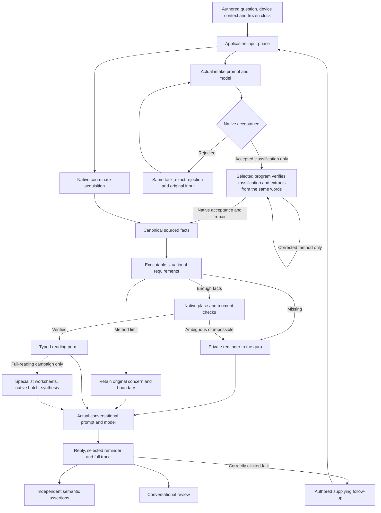

# Elicitation evaluation

The 166 executable cases in `src-tauri/test-fixtures/elicitation/` include the original 145-case bank: all 44 catalogue methods with an explicit, inferred and genuinely incomplete question for each, plus thirteen chart-anchor and context cases. A separate 21-case adversarial bank covers affected actors, ownership evidence, transaction roles, parcel custody and hired-service roles. These are synthetic, authored scenarios checked against the catalogue and cited textbook pages; they are reviewable expectations, not claims of Eileen's approval. The adversarial bank includes known unresolved representation and method gaps; adding it does not claim those cases pass.

`src-tauri/src/elicitation_eval.rs` loads the banks strictly. Ordinary tests fail if a method lacks one of the three groups, a case has an unknown field, or an identifier repeats. Every additional JSON file in that directory must be an ordinary file containing a case array; metadata belongs elsewhere. All loaded banks, including ignored files, enter the campaign fingerprint. Expected answers belong only to the evaluator. They never enter the model prompt.

Ordinary Rust and frontend regressions do not run Gemma. The ignored real-model campaign must be explicitly invoked with a selected provider and a fresh evidence directory. Native campaigns identify their actual weights and decoder. Hosted campaigns identify Google's actual model and wire configuration and never load local weights. Codex teacher/judge jobs use the saved account separately and are not Gemma inference. Report these categories separately; fan noise and a green unit-test count are not model-execution evidence.



The application and campaign share `prepare_reading`; the production path continues through `generate_reading`, while an elicitation campaign stops before specialist interpretation and then calls the same guru. A runtime error is never used to pretend that collecting inputs completed successfully. Every real proposal enters the production acceptance, repair and checkpoint path.

The fixed context is Wednesday, October 7, 2026 at noon in America/New_York, with a usable device fix near Woodbridge, Virginia unless the case says otherwise. Friday therefore means October 9 for these future-event questions. Event dates and venues remain distinct from the chart's understood moment and reader place. Historical overrides, missing coordinates and ambiguous civil times exercise the actual native checks.

Native acceptance separately guards a narrow family of explicit earlier-consultation directives against omitted place/time extraction. Supplied components return to private repair; missing components block readiness and reach the conversational reader. Ordinary device defaults, event dates, quoted speech and later authorized anchor corrections have separate regressions. The guard does not replace recognition of other ways a person may express a historical question.

## Grades and review

Every scenario also has a strict, source-cited reading contract in `src-tauri/test-fixtures/readings/`. All 166 IDs must have exactly one matching rubric before a full-reading campaign starts. Each rubric states its reading method and native support boundary, contingent context requirements, required significator roles, decisive textbook tests, evidence owed for each test, answer obligations and forbidden inferences. The same method can share a recipe while retaining case-specific ownership, operative relationship, answer scope and source rules. These rubrics are evaluation gold, never instructions secretly added to the oracle's input.

Full campaigns report four independent hurdles: **classification, elicitation, extraction, reading**. An interpretation failure does not erase successful input collection. Conversely, successful input collection cannot qualify an absent reading. Rust checks the current input binding, actual chart, required accepted specialist worksheets and delivered answer; a completed procedure receives `structure_pass_review_pending`, not a semantic reading pass. An independent reviewer must examine it against the source rubric and actual chart witnesses. Known unimplemented recipes remain explicit boundaries; a chart or a valid worksheet alone is not a completed reading.

`first-turn.json`, `final.json` and `outcome.json` retain their separate hurdle observations. Immutable call files preserve every original and repaired prompt, schema, raw response and rejection. Each `live.json` checkpoint exposes the current stage and accepted records while a case runs. `report.json` and `review.html` update as cases finish. The full-reading Codex reviewer retains every branch of independent analysis batches and requires four source-supported scores. Unobserved or blocked interpretations cannot receive a reading score.

| Dimension | Checked evidence |
| --- | --- |
| Classification | The substantive method and requested answer facet, including negation and authorized reframing |
| Accepted facts | Selected source-backed fields, relationships, ownership, actual subject/participant retention, and absence of invented anchor overrides |
| Situational completeness | Required missing facts tracked; sufficient inputs do not create extra requirements |
| Elicitation | The guru selects a genuinely missing reminder rather than asking for a resolved fact |
| Native handoff | Chart place/time, exact UTC occurrence when specified, and readiness; specialist methods retain their explicit review boundary |
| Supplying follow-up | Independent final-state expectations check classification, fields, bindings and readiness; a new reply is delivered, no unintended input gaps remain, and ordinary clarifications retain the understood moment |
| Conversation | Full transcript plus flags for repetition, length, workflow vocabulary, unbound questions and premature chart claims; separate human assessment |
| Cost and repair | Every call, rejected attempt, prompt/cache/output token count, first-token time, total wall time and cancellation |

A valid JSON response alone earns no semantic pass. A first-turn pass does not imply a follow-up pass, and neither certifies an astrological interpretation. The 28 methods awaiting specialist review can collect all their inputs correctly while remaining unable to issue an interpretation. A heuristic fluidity flag is a request to examine the words, not an automated judgment of taste.

The first unconstrained hosted full reading completed its three input hurdles but failed independent source review. Its condition lesson contradicted printed p.56 by treating houses 3/9 as weak, and its reception lesson used a disputed object/speaker planet to infer personal feelings, contrary to p.147. The editorial lessons now state the exact native house-capacity exceptions and object-role priority, with the house-capacity source passage included in the actual prompt. An available-job pay role also binds wages to the job's second house, required for a profit facet and selectable for a pay-priority situation. These are source and role repairs, not a declaration that the model's interpretations now pass; original failed readings remain intact.

The next full-catalogue baseline selected all 166 cases but closed after its first four when corrections changed the frozen source. Its three delivered relationship readings collected their inputs, yet failed independent source review: Moon testimony was omitted, an already arranged wedding was treated as needing a fresh occasion, and limited future-contact coverage was converted into evidence of absence. The fourth case, a missing watch, exhausted its deadline after repeatedly selecting both alternative object rulers. This is an interrupted four-case observation, not a completed 166-case campaign. Separate saved-login Codex reviews also scored the two reviewed interpretations only partially correct; structural success did not override those findings.

The revised role contract makes the relationship Moon obligatory unless a selected house ruler claims it, while preserving that house ruler's first claim and the emotional meaning when Moon already represents the querent (printed pp.191–193). Alternative object rulers now receive precise missing-versus-overfilled feedback: compare both, select one now. Contacts and synthesis explicitly start from the stated baseline (printed p.140), distinguish new arrangements from an already agreed event, and retain the source's separating-agreement exception (printed p.99) without inventing its presence in a chart. Empty check explanations are rejected at their exact path; lessons use only the actual allowed state labels. Classification no longer presents an irrelevant person-item structure when the only legal people value is `[]`, and conversational teaching examples are complete literal reply objects. Original receipts and gold remain unchanged. A fresh hosted run must establish whether these repairs improve the actual pipeline.

## Independent conversation review

Review the actual transcript against the exact model inputs and accepted evidence. Record the reviewer, case ID, campaign path, scores and concrete examples in a separate review directory, outside the immutable campaign. Human or agent review is independent of the machine assertions; a green structural grade is not a reason to award good conversational scores.

| Dimension | 0 | 1 | 2 |
| --- | --- | --- | --- |
| Concern and actor | Changes the actual concern or confuses the person/object | Mostly right, but loses a material circumstance or goal | Preserves the concern, actor and operative capacity |
| Evidence and honesty | Invents evidence/conclusion or promises work that is not happening | Honest boundary mixed with vague implication or progress | Distinguishes supplied facts, checked findings and unfinished judgment |
| Useful inquiry | Spoken question does not obtain the tracked missing answer | Obtains it indirectly or adds an unnecessary question | One natural question obtains the required missing information |
| Natural phrasing | Workflow status, stiff case summary or needless verbosity dominates | Understandable but padded or awkward | Concise, direct spoken conversation without processing narration |
| Continuity | Forgets supplied information, names, correction or prior concern | Retains most context but repeats or makes avoidable assumptions | Uses known names/context, follows the current turn and avoids redundant requests |

Mark inquiry N/A when no inquiry is needed; omitting a necessary inquiry scores 0. If infrastructure prevented any reply, record conversation as unobserved instead of pretending to assess its quality. An optional normalized score is the total divided by twice the number of scored dimensions; always retain the individual scores and reasons. This is a review aid, not SME approval of a horary judgment.

Supplying scripts carry their own final-state gold instead of passing merely because one requested slot filled. A fresh concern must route to its actual concrete method. Ordinary clarifications preserve the established question and candidate moment even when phrased “I mean”; those words alone are not permission to reset a reading. The numerical-reframing case sends an affirmative only after the guru actually offers one question, then checks the accepted concern and retained people/ownership. The first-turn grade is never replaced by the later result.

Each campaign writes a fresh manifest and immutable case receipts, including the exact prompts and schemas, raw model outputs, every checkpoint, the first-turn grade, final state and follow-up outcome. The manifest fingerprints source, prompts, fixtures, geocoder data, model bytes and evaluation settings. A source change during a campaign stops it rather than mixing results from different implementations. Failed campaigns are retained.

An authored continuation withheld because the actual inquiry was not eligible remains an unqualified journey, even when the first turn passed. It is counted separately from completed semantic failures and execution interruptions. Both the primary authored gap and its explicitly declared alternatives can authorize the supplying script; unrelated requests cannot.

Receipts are published atomically without replacing an earlier receipt. A failed write retains its partial file and reports its path; report/HTML indexes are derivatives replaced atomically. Fatal campaign setup, storage or source-freeze errors attempt an immutable `interrupted.json` and close the index as `infrastructure_interrupted`, preserving all completed case grades. If the filesystem cannot record even that, the returned error explicitly includes the additional recording failures. A completed campaign with failing grades returns a test failure while retaining completed status; it does not produce a spurious infrastructure interruption.

`review.html` is the campaign index; each case opens `trace.html` with the conversation and expandable expectations, accepted facts, calls, validation history and native state. `report.json` carries the machine-readable grades. Review these together: a correct fact record can still accompany a stiff or irrelevant reply.

## Recorded rubric corrections

The initial twelve-case smoke campaign is retained unchanged. Its relationship cases revealed that checking a participant's relationship was insufficient: the subject must also bind that participant into the reading. The assertions now check that binding. Chart-city assertions now require the complete Springfield/state label, rather than matching an arbitrary occurrence of a state abbreviation; inferred event-city assertions require a Virginia qualifier as well as the city. Trust accepts the book-compatible truth and situation facets instead of requiring one synonymous framing. A genuinely unresolved concern may retain no frame or the explicit unclassified placeholder, provided its missing-concern requirement remains; neither permits a fabricated appearance or relationship question.

Before the first full-catalogue run, independent source review replaced two poorly specified incomplete examples. Tax's principal-money recipe does not universally require a title-owner question, and an undertaking need not disclose its itinerary. Those cases now give a clearly identified affected person whose operative relationship is genuinely absent. These are recorded authoring corrections; failed model outputs are never deleted or regraded to conceal failures.

The second smoke run exposed two further rubric gaps. After the unidentified pet is described as the cat Moss, the final record must retain Moss's name, species and supplied tabby appearance, rather than merely filling animal_kind. The seller/owner case's supplying gold now permits an input-complete sale: Alice's ownership and Bob's seller capacity are both known, and this sale does not universally require another relationship question (printed pp. 26, 172). Whether Bob acts as a principal seller or a mediator remains a judgment question for expert review (printed p. 168); an input permit is not that review. The original failed campaign retains its original gold and results.

The future-partner edge preserves the book's explicitly unnamed future marriage role (printed pp. 143, 191, 196) without inventing a person or demanding a spouse's name. Its canonical role binds the principal whose future partner is described, and native house selection derives the seventh from that principal. This does not broaden the method's existing expert-review boundary.

Independent review also corrected three old implicit gold values (movable deal, offered job and contest) from the raw word Friday to the expected civil date 2026-10-09. The original spoken quote remains Friday in the production record; normalization changes the value, not the evidence. Earlier receipts retain their original rubric.

Before the broad run, the rubric was strengthened to retain substantive subjects and actor bindings, including both political candidates and the relevant office's locality. Optional canonical mentions search only accepted subject, participant labels and resolved facts; seeing a name in the original question or transcript does not satisfy them. The DST-fold case now requires the later UTC instant as well as its civil time, because both occurrences share the same clock label.

A case may explicitly author alternative genuine gaps: the repeated-hour example accepts a question about the chart moment or the narrower first/second occurrence. These are case-specific alternatives, never a global equivalence between location, time and occurrence. Subject alias assertions likewise allow reviewed vocabulary such as barbecue/BBQ while still requiring the correct substantive event.

The exact `smoke-3b` run stopped on disk exhaustion after eleven completed cases: seven structural first-turn passes, two completed semantic failures and two execution interruptions. Among executed continuations, one passed, one failed and one was interrupted. The preserved scenario evidence was only about 18 MiB; trace duplication was not the disk-capacity cause. Independent notes retain the remaining subject/repair, trust-facet and conversational failures. That run remains incomplete; later runner/grammar repairs require a fresh campaign rather than retroactively changing its receipts or gold.

Before the broad run, the lost-pet first-turn rubric was strengthened to require the already identified generic animal and forbid invented appearance, clock occurrence and chart overrides. "Escaped this morning" belongs to search context, not appearance (printed p. 147). Smoke-3b's bad appearance previously surfaced only when the supplied tabby description conflicted with it. The original expectations and result remain unchanged; the separate `review-notes/lost-pet-gold-strengthening.json` records the rationale and before/after hashes.

## Running

### Hosted Gemma

The test-only Rust adapter uses Google's `gemma-4-26b-a4b-it` through the Gemini `generateContent` endpoint. It translates the application's existing system/user/assistant messages, including rejected proposals and repair instructions, without replacing their content. Hosted output is **unconstrained text**, with neither `responseMimeType` nor `responseJsonSchema`. The requested worksheet contract remains in the actual application prompt; the model must follow it. Malformed or invalid proposals enter native rejection and repair. Token-limited text also reaches those checks verbatim, with Google's actual finish reason retained in the provider receipt; truncation is not recast as a service error that bypasses repair. All acceptance, requirement checks, native chart tools and specialist scheduling still run through the application. Thinking is disabled (`minimal`), temperature and seed are zero. This is hosted exploration, not qualification of the on-device 12B model. The application's inference default remains local, with constrained individual text steps and unconstrained independent analysis batches.

Store the API credential in a private ordinary file (0600) **outside this repository**, then select the hosted provider explicitly. The key travels in an auth header, never a URL, prompt, manifest or trace. Redirects are disabled. Codex reviewer children discard hosted credential variables and credential-file paths.

```sh
HORARY_EVAL_PROVIDER=google \
HORARY_GOOGLE_KEY_FILE=/private/path/google-api.key \
HORARY_EVAL_EVIDENCE=/fresh/path/hosted-campaign \
HORARY_EVAL_FULL=1 HORARY_EVAL_BATCH=4 \
HORARY_EVAL_CASE_SECONDS=1800 \
cargo test --manifest-path src-tauri/Cargo.toml --locked --lib \
  elicitation_eval::real_model_catalogue_campaign -- --ignored --nocapture
```

Hosted `BATCH=4` runs four independent consultations with separate deadlines. Their independent analysis steps can also proceed concurrently, under a shared four-request HTTP limit. Exact provider request/response bodies and reported usage remain in each call receipt; partial successful analysis branches survive an outer batch failure. Cached tokens are recorded only when Google actually reports them. The first schema-constrained probe succeeded, but the larger extraction schema returned an HTTP 400. Those attempts remain separate failed receipts; after the user's explicit direction, hosted evaluation measures prompt-following without provider output constraints.

The supplied project's initial live run hit a 16,000-input-token/minute free-tier quota. The adapter now asks Google's `countTokens` for each exact request and reserves its tokens in a shared 61-second window, defaulting to 14,000 tokens for margin. `HORARY_GOOGLE_INPUT_TPM` overrides that explicitly configured budget. Quota waiting is visible separately from HTTP generation time and is cancellable. A single over-budget prompt is not silently truncated. Authentication, unavailable-model and quota errors stop a campaign with preserved receipts. Completed generation HTTP 500/502/503/504 responses permit at most two cancellable, paced service retries; every failed response remains in `generation_attempts`, and the actual submitted-request count includes retries. Uncertain transport, quota, authentication, request errors and unusable model outputs are not resubmitted by this layer. Model-output rejection goes through native semantic repair. Case deadlines include pacing and service retries, so hosted campaigns need longer deadlines than native campaigns. Other uses of the same Google project can still exhaust its shared quota.

`HORARY_EVAL_MODES=explicit,implicit` selects complete-information groups; omit it to retain all three groups and edge cases. Filters remain exact IDs or method names. Google's [Gemma API guide](https://ai.google.dev/gemma/docs/core/gemma_on_gemini_api) documents this hosted model; its [token-count API](https://ai.google.dev/api/tokens) supplies the pacing counts.

### Native Gemma

The [bounded Rust optimization driver](../tools/horary-loop/README.md) consumes completed cases while discovery runs, reviews through the saved Codex login, proposes typed teaching edits and measures paired control/candidate trials. It retains every failed receipt, reuses verified completed work and stops behind uncertain paid jobs. The [optimization guide](PROMPT_OPTIMIZATION.md) distinguishes discovery, training, reserved validation and interpretation qualification.

The original 145-case discovery union collected 68 first-turn semantic passes, 51 semantic failures and 26 execution interruptions across the original run and its source-identical continuation. Of 49 scripted supplying turns, 18 ran: eight passed, eight failed semantically and two were interrupted; 31 were withheld. Those unconstrained batch-discovery results do not qualify the production decoder. The separate 21 cases require a fresh campaign and split; the original gold, source hashes and receipts remain unchanged.

Set `HORARY_NATIVE_LLAMA_TEST_MODEL` to the local Gemma 4 12B IT QAT GGUF and `HORARY_EVAL_EVIDENCE` to a **new** output directory. Then run:

```sh
cargo test --manifest-path src-tauri/Cargo.toml --locked --lib \
  elicitation_eval::real_model_catalogue_campaign -- --ignored --nocapture
```

`HORARY_EVAL_FILTER` selects comma-separated exact case IDs or exact method names. Substring matching is excluded so selecting one case cannot silently expand an experiment's budget or reserved set. `HORARY_EVAL_PHASE` records exploration, tuning or validation. `HORARY_EVAL_CASE_SECONDS` and `HORARY_EVAL_MAX_CALLS` bound a case, including its scripted continuation; reaching a bound remains unqualified and is counted as execution interruption, separately from completed semantic failure. Cancellation reaches native generation, although synchronous lesson preparation may finish before observing it. One resident model serves the campaign and caches stable lesson prefixes. Exact production constrained decoding is used for individual calls; independent specialist worksheets use the application's native batch path when `HORARY_EVAL_FULL=1` selects a full-reading campaign.

If the pinned weights are absent, the ignored `hf_cache::tests::real_pinned_cache_acquisition` check exercises the application's Rust downloader against the real shared Hugging Face cache. It requires a fresh `HORARY_ACQUISITION_EVIDENCE` directory, records acquisition results and uses an isolated registration; it never writes private readings. It downloads only the bundled immutable artifacts and verifies their published byte lengths and checksums. Ordinary tests do not download weights.

`HORARY_EVAL_BATCH=4` is an explicitly labelled exploration mode. Four independent case flows submit their next model tasks to one coalescing dispatcher, which calls the native batch API with up to four separate prompts. That API does not accept each case's production JSON constraint, so these generations are unconstrained; every output still passes the actual native acceptance and repair path. Group cancellation interrupts peers and is reported as infrastructure interruption, never silently attributed to each peer's prompt. Full-reading runs require the default batch setting of one. Validate explored repairs again with exact production constrained decoding before claiming they work in the application.

Tune against a declared subset, inspect failures, make one explained change, and repeat that subset before running untouched cases. Preserve the original expectations unless source review establishes an error, recording that correction explicitly. Keep first-turn correctness, iterative completion and conversational quality separate; report per-method failures rather than hiding them in one average.

All current scenarios are authored development cases whose gold is visible to the developers. A broad exploratory pass is not a blind holdout qualification. Declare genuinely held-out questions before tuning if making that stronger claim, and replay explored repairs with the exact production decoder. Freeze source, prompts, fixtures and this evaluation document before every real campaign; write independent review notes elsewhere while it runs. Do not regenerate living documentation during the freeze. The complete serialized prompts currently repeat some input and request data in JSON and HTML; a future content-addressed trace format may reduce duplication only if every exact prompt/schema/input/output remains reconstructable and hash-verified. No existing evidence needs deletion for that change.
