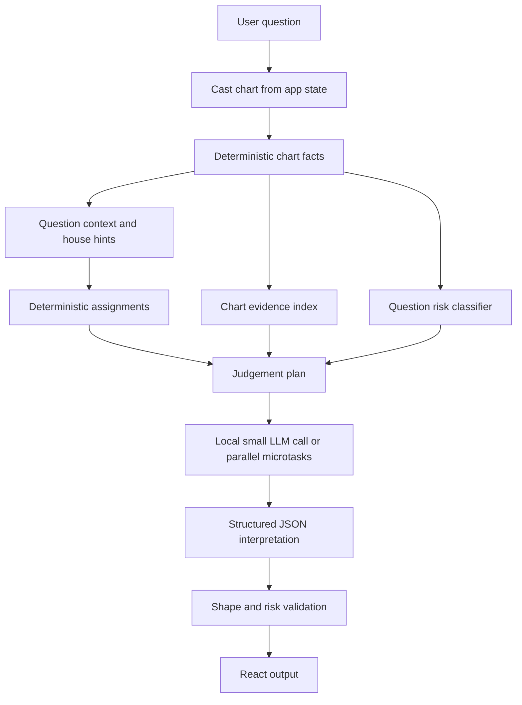
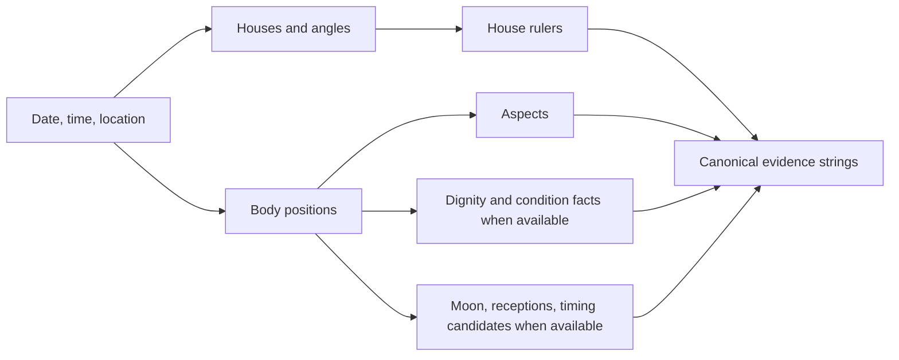
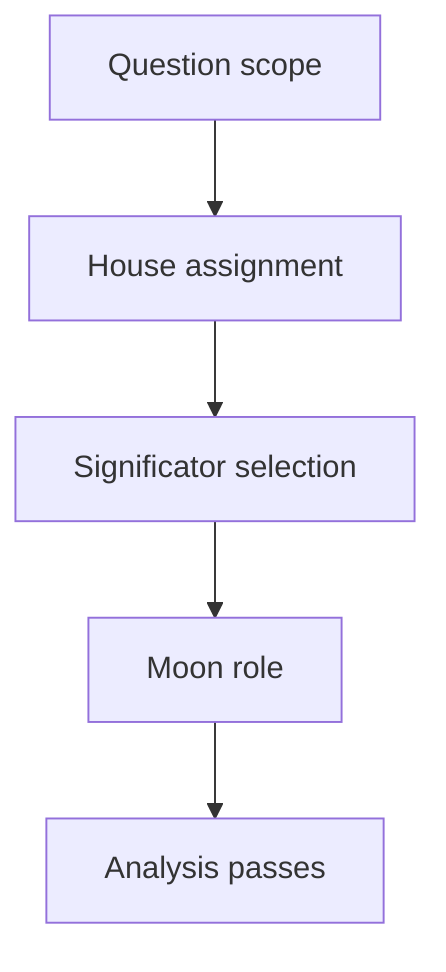
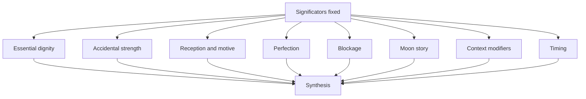
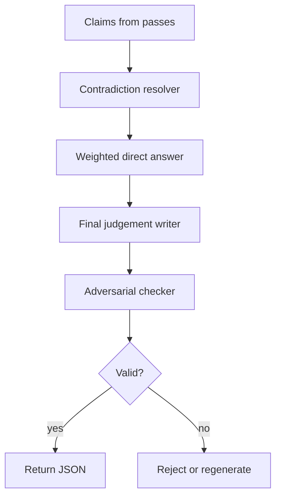
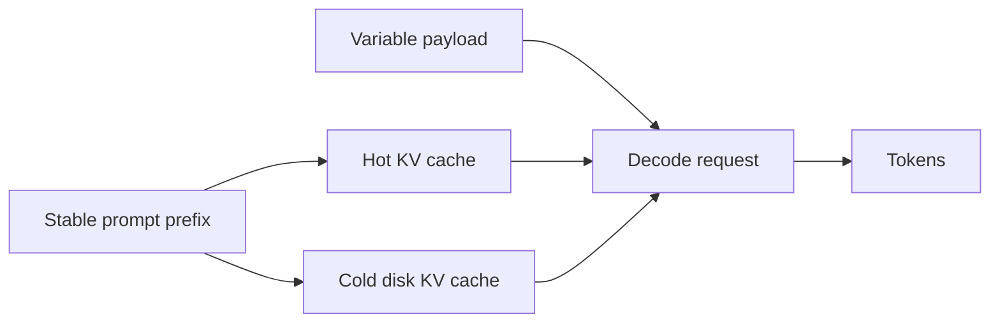

# Scaffolded Horary Process

This document explains the judgement scaffold used by the local AI pipeline. It encodes procedure from the local traditional horary source summary without bundling or quoting the source text.

## Whole Pipeline

The model is never asked to calculate a chart. It receives facts, chooses how to weigh them, and must cite supplied evidence for each claim.

## Deterministic Inputs

The evidence index gives the model short, copyable facts such as house ruler, body placement, applying aspect, timing candidate, and void Moon status. If a fact is missing, the model must say it is missing or mark confidence low.

## Setup Passes

Setup is serial because later judgement depends on it:

- `question_scope`: reduce the wording to the actual horary question and identify whose question it is.
- `house_assignment`: assign the querent, quesited, money, opponents, helpers, property, illness, or other concrete topics.
- `significator_selection`: use traditional house rulers first, then the Moon and natural rulers only where appropriate.
- `moon_role`: decide whether the Moon is querent co-significator, quesited significator, or descriptive flow testimony.

## Parallel Analysis

These passes are designed to become separate small-model calls:

- `essential_dignity_pass`: condition, competence, corruption, or fitness of each significator.
- `accidental_strength_pass`: practical power to act, including angularity, retrograde, speed, combustion, cazimi, under beams, and severe houses when supplied.
- `reception_pass`: motive and inclination, kept directional and separate from dignity.
- `perfection_pass`: whether the event can happen by exact applying contact, conjunction, translation, collection, antiscion testimony, or placement testimony.
- `blockage_pass`: prohibition, frustration, refutation, sign change, station, or third-party interference.
- `moon_story_pass`: the Moon's condition, void status, recent separation, next application, and emotional flow.
- `contextual_modifiers_pass`: Parts, fixed stars, antiscia, outer planets, and planetary hour only after core testimony.
- `timing_pass`: timing only after event likelihood is established.

Each pass should return narrow claims, not finished prose.

## Synthesis And Check

The final answer is not a vote count. A single severe blocker can outweigh several minor positives. A clean perfection with good reception can outweigh weak descriptive noise. High-stakes questions stay symbolic and include cautions.

## Output Contract

The local model must return:

- `summary`
- `directAnswer` for ordinary questions when evidence supports one
- `confidence`
- `judgementTrace`
- `keyFactors`
- `cautions`
- `followUpQuestions`

Every `judgementTrace` item must include a step id, finding, concrete chart evidence, and confidence. Every `keyFactors` item must include a factor, concrete chart evidence, and interpretation.

## Cache Shape

Stable prefix contents:

- global doctrine
- microtask instructions
- output schema
- verifier checklist
- prompt, schema, and tradition-profile versions

Variable payload contents:

- question text
- chart facts
- settings
- risk classification
- deterministic assignments

Cache keys include model hash, binding/build identity, context size, generation settings, prompt version, schema version, and tradition profile. Any mismatch invalidates the cache.

## Review Questions For Eileen

- Are the house assignment defaults right for the kinds of questions users will actually ask?
- Are there domain modules missing from the first release?
- Should the final prose be more terse, more teaching-oriented, or more client-facing?
- Which high-stakes question categories should be blocked outright rather than answered symbolically?
