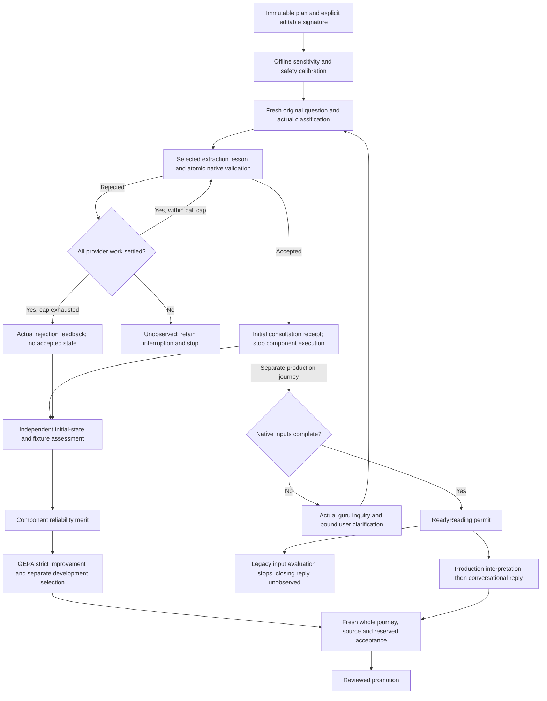

# Prompt optimization

The optimization loop proposes changes to model teaching, then measures them through the application's actual native checks. It preserves the book, accepted facts, schemas, guards and authored expectations. A proposal is an evidence-backed artifact; it does not edit the running application.

## Executable signatures and candidates

The shared Rust crate `crates/horary-prompt-program` supplies `Program`, `Override`, `Edit`, `Evidence`, `Signature` and paired comparison policy. A signature comes from the actual stage and original application input, including during repair:

| Selector | Meaning |
| --- | --- |
| ``stage`` | An existing stage such as intake, conversation or judgment |
| ``recognition_phase`` | classify_question, complete_selected_program or update_selected_program; null is a wildcard |
| ``method`` | The resolved consultation method, or the reading-request binding's method; null is a wildcard |

The selector never comes from a rejected model worksheet. Scoped overrides must not overlap. Each pins the original stable system guide's SHA256 and supplies either a full replacement or at most eight short exact edits, never both. Every edit must match once in one original teaching region outside protected quotations; edit ranges must be disjoint. A matching override with a stale guide fails, rather than silently using baseline teaching.

Only the first system message changes. Original words, native input, schema, rejected-answer feedback and other messages stay intact. Teaching before, between and after `<book_extracts>...</book_extracts>` blocks is editable. Every quoted block, including delimiters, must remain byte-for-byte identical in the same order; replacements cannot add, remove, reorder or alter these blocks. Unbalanced or nested blocks are rejected. The automatic writer receives ordered teaching regions and chunk hashes, with immutable quotations omitted, and proposes exact edits. Special chat-control tokens and unchanged candidates are rejected. Each applied call records candidate ID, selector, original-guide hash and replacement-guide hash. Those hashes separate changed teaching from existing cached prompts.

A Program carries the discovery manifest hash, rationale, hashed evidence references, and nonempty disjoint training/reserved IDs. Evidence must identify a training case, file, SHA256 and JSON pointer. Native validation and the loop's receipt registry check these bindings. These mechanical protections cannot certify the semantic accuracy of newly written teaching; source review and the experiment remain necessary.

## Two kinds of grading

Native scenario grading checks method/facet, actual sourced fields, actor/subject bindings, missing-information requests, clock/place behavior, readiness, and scripted continuation. Invalid or incomplete worksheets follow the real repair path; every rejected attempt remains in the receipts. A valid object or cast chart is insufficient. Complete elicitation for an expert-review method can correctly remain ready=false.

A separate Codex process reviews the actual transcript and evidence. It scores concern/actor, evidence/honesty, useful inquiry, natural phrasing and continuity from 0 to 2, with reasons and source-bound citations. Inquiry alone may be N/A; an absent reply is unobserved. The Codex review does not replace native grades or astrology SME assessment.

The `horary-loop` tool invokes the user's existing Codex login through an ephemeral, read-only process with tool features disabled and a supplied output schema. It removes API-key environment overrides and sets no model override. Exact prompt, packet/schema hashes, invocation, JSONL events, costs and validated result are retained in a durable ledger. Failed or uncertain paid jobs stop the automatic round. Local recovery can revalidate an unchanged saved answer without another model call; a new submission requires an explicit retry. The writer consumes successful training reviews to propose one coherent narrow candidate or abstain; native defects are returned as `repair_required`.

The Rust `horary-optimize` driver chains one bounded round: discovery training review, reuse of completed reviews and a saved writer proposal, then the fixed paired experiment. Its immutable plan preserves the review-job budget across resumes and limits the number of distinct affected native cases. Defaults are one training review job, six cases per review batch and at most nine affected native cases. No writer runs without a completed review, and no native trial runs after abstention, a native-repair request or excessive scope. This is automated evidence collection and comparison; it does not promote application defaults.

## Iterative GEPA search over neural functions

[`horary-gepa`](../tools/horary-gepa/README.md) adds a conventional iterative optimizer before that final comparison. It uses the LLM-independent engine from the alpha Rust `dsrust-gepa` port at exact revision `f24adde08c1d8850e4d7079d019643bb40f905cb`; upstream numerical conformance and local adapter checks are separate from model quality. This initial path uses reflective mutation and development selection, with merge disabled. It neither reformats the application's model requests into DSPy prompts nor replaces native acceptance with an optimizer-specific schema.

Three execution targets are available. **Classification** validates a method/facet frame with the actual native executor and same-step repair; authored labels grade it without unrelated chart or prose calls. **Initial extraction** starts with the original synthetic question, runs the actual classifier and selected extraction lesson, and observes the atomic native patch immediately after acceptance. That test-only boundary comes before place, moment, chart, conversational reply or supplying turns. It optimizes one method's `intake / complete_selected_program` teaching. Its current inspected capture selects a guide, never supplies an accepted fact record to the measurement. A target that the classifier never reaches is unobserved; gold is not inserted to reach it. Older input-journey plans retain their full conversational execution and original review identities.

Input reviews have a separate hard reservation budget and exact trace/source/prompt/schema bindings; completed paid answers are reused. New initial-extractor reviews cite the actual accepted consultation or settled rejection, its native records and the original synthetic fixture. They assess sourced facts, actor identity, frame and honest unknowns before fixed stages run. Conversation and interpretation remain unobserved. Historical whole-input reviews retain separate classification, elicitation and extraction scores: observed conversation must cite its reply, native scores cite state/results, and classification and elicitation also cite the book. Actor identity, honesty and continuity remain noncompensating full-journey gates. Neither protocol accepts expected-answer-only scores. Development reviews select candidates but never reach reflection.

**Reading-stage journeys** obtain a real `ReadyReading` permit from the original question, then execute the production interpretation pipeline. The independently reviewed objective belongs to one selected specialist stage, while whole-reading source obligations and input/conversation guards remain separate acceptance gates. No accepted worksheet or chart is injected to make that stage reachable. These adapters are implemented; their availability does not establish a measured prompt improvement or a correct complete reading. None of these component checks qualifies the local model, voice or a packaged application. A blocked method cannot become a supported reading by optimizing its prompt.

Each search splits the frozen training pool again: reflection training supplies failures to the writer; separate development cases rank candidates. Original reserved cases stay outside search. GEPA selects a parent and minibatch, Codex revises one actual editable teaching region from native failure feedback, and fresh hosted Gemma evaluates the changed region. Actual protected book quotations and all native/tool contracts remain exact. Completed sealed baseline captures may serve as checked controls only when every classifier and repair prompt/input/schema matches and the native executor consumes the original prefix exactly.

~~~mermaid
flowchart TD
  A["Pin native function, original prompt, authored labels and split"] --> B["Separate reflection training and development within training pool"]
  B --> C["Current native prompt inspection; checked archive or explicit fresh control"]
  C --> D["GEPA parent and training-minibatch selection"]
  D --> E["Actual native function and same-step repair"]
  E --> F{"Completed measurement?"}
  F -->|no| X["Preserve interruption; no fabricated fitness or automatic replay"]
  F -->|yes| R{"Input journey?"}
  R -->|yes| S["Independent Codex review: exact synthetic rubric, native trace and book pages"]
  S --> T["Verify citations, native grades and actual first/supplying observations"]
  T --> G["Chosen component objective; report whole-journey guards separately"]
  R -->|classification| G
  G --> H["Codex login: reflect on one editable teaching component"]
  H --> I["Protect book blocks; validate actual Program signature"]
  I --> J["Fresh unconstrained hosted Gemma; same training minibatch"]
  J --> K{"Improves training fitness?"}
  K -->|no| D
  K -->|yes| L["Separate development scores; candidate frontier"]
  L --> D
  D -->|bounded search closes| M["Selected overlay and candidate ancestry; no promotion"]
  M --> N["Fresh full journeys, independent source review and fixed reserved comparison"]
  N --> O["Review and integrate only a validated improvement"]
~~~

Immutable operation receipts reconstruct engine state from the same seed on resume. Controller/executable/guide/capture/fixture/book fingerprints, exclusive ownership and pre-submission teacher/reviewer/student reservations guard this replay. A changed prompt always needs new student generation; completed-prefix calls and uncertain requests are never silently resubmitted. Input journeys require explicit fresh controls; no downstream capture reuse is permitted. GEPA's iteration-boundary metric budget is reported separately from the hard paid-call reservations. The command and receipt layout are documented in the tool's README.

## Traced corpus and observation boundary

The frozen bank has 145 synthetic cases across all 44 contracts plus additional edge cases. `full-suite-1` retains 90 completed outcomes and its disk-exhaustion interruption. Its native report records 46 first-turn passes, 30 completed semantic failures, 76 delivered first replies, 12 supplying turns executed and five supplying-turn passes. The remaining native execution interruptions and withheld journeys stay visible; these counts do not imply 90 usable readings.

`full-suite-1-remainder` collected the 55 IDs without completed original outcomes, including previously partial cases, using the same verified source, fixture, book, model and primary executable. Its continuation plan binds the original completed outcome hashes. The [sealed union](llm-process/discovery-145-union.json) retains both campaigns: 145 distinct outcome receipts, 68 first-turn semantic passes, 51 completed semantic failures and 26 first-turn execution interruptions. Of 49 scripted continuations, 18 ran: eight passed, eight failed semantically and two were interrupted; 31 were withheld. Completed outcome IDs, not partial directories, define coverage. [Grouped findings](ELICITATION_FINDINGS.md) distinguish prompt defects, native invariant gaps and over-specific rubric expectations; the original grades remain unchanged.

Every completed case has exact prompts, schemas, raw answers, rejected attempts, accepted clipboard, checkpoints and separate first/supplying grades. Independent review covers all 66 specialist scenarios and the core and edge cases, recording unobserved conversations separately. Native structural coverage, actual conversational observations, automated Codex reviews and SME judgment remain separate. These text-only elicitation campaigns do not establish voice latency, complete interpretation or packaged acceptance. Diagnostic counts should be regenerated from the named receipts rather than inferred from green native checks. The separate 21-case adversarial bank brings the executable catalogue to 166; it exposes further representation and method gaps and has not been qualified by these 145-case campaigns.

## Reserved cases and measured trials

The split keeps missing-information examples in training and deterministically reserves one sufficient mode per family; edge cases use deterministic ID parity. Candidate writers receive training evidence, not reserved words, gold, traces or prompt versions. The bank has already informed manual engineering, and some teacher/example overlap has been disclosed. This is reserved validation, not a blind benchmark.

The horary-experiment runner selects the affected fixture families, writes an immutable plan and runs paired native training control and candidate campaigns, followed by independent conversation reviews. A failed training comparison records its blockers and withholds reserved validation. When training qualifies, reserved control and candidate campaigns and their separate reviews test the same fixed candidate. The pairs use the same native executable, weights, cases, decoder, sampling and source/fixture fingerprints. Trials use production-constrained single requests; earlier raw batch exploration is discovery evidence, not their paired control.

Training must show a semantic, complete-journey or conversational improvement. Reserved validation confirms no regression and need not independently improve. Comparison blocks changed or absent fingerprints, unexecuted candidate overlays, unequal case sets, interruption, loss of a previously passing first turn or continuation, missing paired reviews, conversational regression, and candidate honesty below 2. Partial trial directories are retained rather than silently retried.

Eligibility is for review of the measured change. Unchanged failures may still remain in both sides of a pair; eligibility does not certify every case, full horary judgment or packaged voice behavior. Method-scoped trial selection uses the fixture's declared family, so cross-routed wish/unclassified cases need an additional broader regression gate when the actual selected lesson changes. New conditional-branch cases are authored separately from frozen campaign gold.

## Loop

~~~mermaid
flowchart TD
  A["Frozen native source + book + fixtures"] --> B["Gemma discovery: exact calls and checkpoints"]
  B --> C["Native semantic and journey grades"]
  C --> D["Bounded Codex training review; reuse completed receipts"]
  D --> E{"Teaching or native defect?"}
  E -->|native defect| F["Separate source repair + fresh baseline"]
  E -->|teaching| G["Reuse saved writer proposal or one scoped Program"]
  G --> H["Validate selector, evidence and protected source"]
  H --> I["Paired native training: control + fixed candidate"]
  I --> J["Separate paired Codex conversation grades"]
  J --> K{"Training improves without regression?"}
  K -->|no| L["Keep rejection and all receipts; reserved withheld"]
  K -->|yes| M["Paired reserved validation: control + same candidate"]
  M --> N["Native + conversation comparison"]
  N --> O{"No reserved regression?"}
  O -->|no| R["Keep reserved rejection and all receipts"]
  O -->|yes| P["Reviewable candidate with remaining failures stated"]
  P --> Q["Source review, integration and broader regression gate"]
  F --> A
  L -->|new round, training evidence only| D
  R -->|new round, training evidence only| D
~~~

The tool is in [`tools/horary-loop`](../tools/horary-loop/README.md), with the typed candidate and comparison crate in [`crates/horary-prompt-program`](../crates/horary-prompt-program/src/lib.rs). Authoritative implementations are their `src/{lib,comparison}.rs`, `src/{lib,packet,types}.rs` and the `horary-optimize` / `horary-experiment` binaries. Results and diagnostic indexes can be regenerated from receipts without altering the original trials.

The dedicated CI job checks the typed program, bounded loop and GEPA adapter for formatting, ordinary regressions and all-target Clippy without model credentials. Paid Codex reviews and hosted or local Gemma campaigns remain explicitly invoked experiments with separate receipts.

## First measured trial

The [recorded trial](llm-process/optimization-trial-1.json) retains the exact scoped teaching edit, replies, independent review reasons and paired native outcomes. On two training cases, both versions passed their input checks and completed the one scripted continuation. Independent Codex review found three conversational score improvements. On the reserved case, both input records passed, but the candidate invented Willow's gender, lowering its honesty score to 1. It also returned chart-readiness narration rather than an interpreted answer. The comparison rejected it, and the application retained its original teaching.

This result demonstrates the rejection path, not a successful prompt improvement or a complete horary reading. The machine grades, conversational reasons, applied prompt hashes and unchanged source boundary remain separate. Failed local validation of paid reviews was repaired by revalidating the original answers; no model review was purchased again.

The live trial exercised the Codex reviewer/writer and paired native experiment through their component entry points. The complete `horary-optimize` coordinator has mechanical regression coverage; it has not yet completed a fresh live round from discovery review to final comparison. Those are separate qualification claims. A replay must retain the existing paid-job ledger and native receipts rather than purchase another demonstration.

## Component merit and complete-reading acceptance

New method-scoped input GEPA plans name the `extractor-reliability` objective and pin `initial_extractor_observation=true`. Only initial `complete_selected_program` teaching is mutable. A separate independently cited assessment grades its accepted facts, known actors, question/frame and honest unknowns against the frozen fixture. The native component grade excludes fixed chart anchors, readiness and conversation. Its acceptance receipt binds the actual initial target record, consultation revision and input hash. Later supplying calls cannot rescue an incorrect initial record or inflate its repair count. Fewer focused attempts improve reliability within disjoint semantic score bands; incorrect facts score zero, and no component merit qualifies a reading.

A fully settled target rejection at the native call cap is useful negative feedback, with no invented accepted state. Missing, uninvoked, interrupted or uncertain observations stop measurement. Original failed runs and paid review identities remain intact; new protocol identities prevent a changed score from masquerading as a reused historical review.

The diagram separates optimizer fitness from deployment acceptance. Conversation actor, continuity and honesty guards remain noncompensating at acceptance. The initial observer generates no guru reply or interpretation. Whole journeys still exercise genuine inquiries, bound supplying turns, device/user anchor selection and the actual handoff into interpretation. Every proposed overlay needs complete reading/source review and untouched reserved checks. No new hosted semantic improvement is established by calibration or Rust tests.
