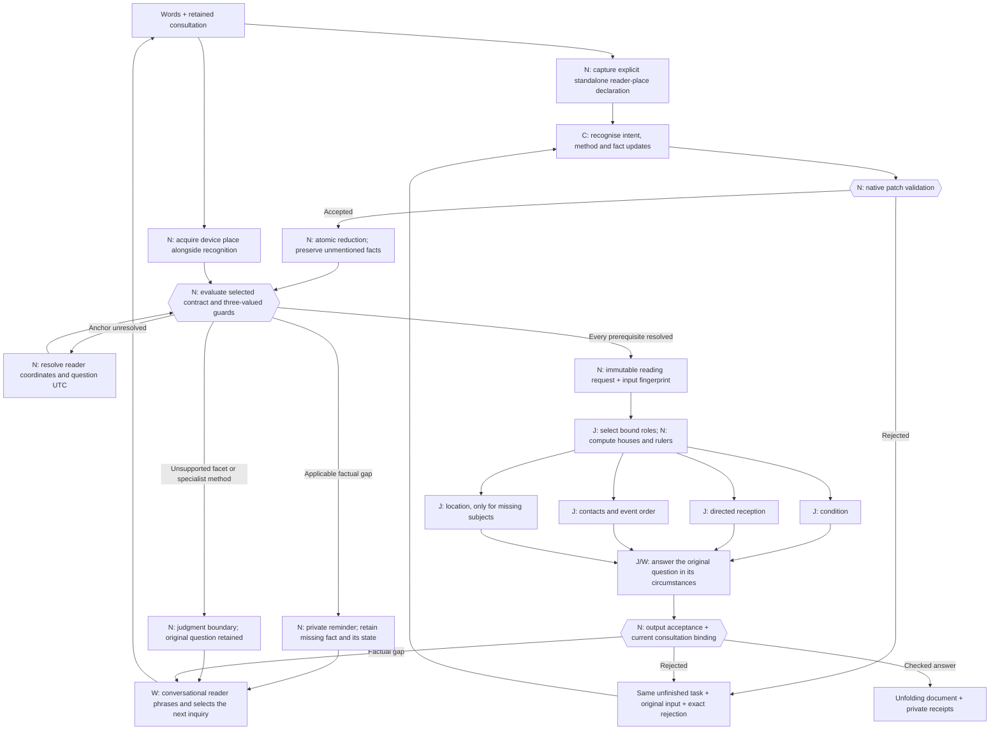

# Executable reading contracts

Generated by Rust from `reading_contracts.rs`. Version: `frawley-reading-contracts-2026-10-07.1`. The catalogue generates the live recognition instructions and schema, selected reading instructions, private conditional reminders, readiness gate, and this reference. Edit the catalogue and regenerate; do not edit this generated document by hand.

There are two operations: **elicit information**, then **generate a reading**. Classification remains revisable. Recognition completes a fact patch; it cannot declare a consultation ready. A private Rust constructor evaluates the same requirements that prepare the reader’s private reminders.



**C** is classification/extraction; **J** is contextual horary judgment; **W** is writing; **N** is native computation or validation. Every reading worker can return a typed factual need instead of pretending to complete its work. Its response is checked before completion. All independent analysis responses are recorded before repair begins. The production batch holds up to four inference sequences sharing one model.

Known factual slots provide authored example questions to the conversational model. They never write directly into the conversation. A contextual detail discovered by a reading worker keeps that worker's specific, checked question in the same consultation. Both the question and its reason remain in the receipts. A worker cannot re-ask ownership or capacity already resolved in its handoff.

Facts can be **missing, proposed, resolved, conflicting, or unavailable**. Applicability is computed, never saved as N/A. An unknown guard asks for its controlling fact; it does not act as false. An unavailable required fact prevents a handoff and is acknowledged without repeatedly demanding an answer. A correction retains its previous observation in the change receipts and invalidates dependent interpretation. A contextual correction retains the chart anchor; an explicit anchor correction can recast it.

The reader's place and the question's understood moment are separate from an event's venue and start. Device acquisition is a real native operation, with failure receipts. A place or time explicitly supplied for an earlier chart must be resolved; it cannot silently fall back to device defaults. Civil clock gaps and overlaps return to the person for clarification.

A standalone “I'm asking from …” declaration supplies its place before text recognition, with an exact quote and a named native receipt. For direct audio, the same rule runs on the model's checked meaning summary; that summary still needs to accurately preserve the spoken place. The venue of a fair does not match that rule. An explicit “How many …” goal cannot be accepted as an event prediction. More ambiguous language still requires model recognition and, where necessary, clarification.

The same Gemma weights currently serve every program. The selected instruction card and frozen handoff vary. Inapplicable facts and background participants stay in the consultation but are omitted from a reading handoff. Stable teaching prefixes use the existing native lesson cache; no second model or Python environment is introduced.

Shape checks and source-span checks cannot certify semantic extraction or astrologically correct judgment. Authored tests establish controller behavior; real-model probes are separate evidence. `Implemented` means the native worksheet path is wired, not Eileen's approval or empirical prediction accuracy. `ExpertReview` cards elicit their specified inputs but explicitly block an unreviewed judgment. An exact sales count has no generic fallback.

Additional implemented-method boundaries are executable too: an unspecified money source needs a reviewed role, and a purchase/rental frame involving another title owner cannot silently use that owner's house as the buyer's frame. The private clipboard retains that limitation and the case; the conversational model explains it naturally. Numeric timing remains subject to the calculation boundary in the full process reference.

## Canonical records and boundaries

| Record | Authority | Behavior |
|---|---|---|
| `Turn` | Model proposal | Optional replacements, typed updates, exact quotes from current words or the retained original question; unmentioned facts stay untouched |
| `Consultation` | Native reducer | Original question, revisable frame, participants, subject, fact states, pending requirement, and change receipts |
| `Conversation` | Model, separate cached lesson | Replies to the person, chooses a native reminder ID; cannot mutate facts or declare readiness |
| `Plan` | Catalogue | Computed applicable gaps, private question examples, and named method limitations |
| `Anchor` | Native tools | Reader coordinates and question UTC, separate from story place/time |
| `ReadyReading` | Private Rust constructor | Applicable required facts, supported facet, implemented program, and fingerprint of the complete selected inputs; no public deserialization route |
| `ReadingResult` | Checked native boundary | Bound judgment, typed information need, or named limitation |

The [complete process reference](LLM_PROCESS.md) includes actual scheduler requests, prompts, analysis schemas, cache behavior and calculation limits. [The earlier elicitation design](ELICITATION_DESIGN.md) is the research record. The machine-readable [catalogue export](llm-process/reading-catalogue.json) is generated from these same Rust values.

## Contracts
### Relationship, marriage and feelings (`relationship`)

Frawley, *The Horary Textbook*, printed pp. 140, 191–200. Coverage: `Implemented`. Owner requirement: `None`. Allowed facets: event, situation, timing.

Prospective partner is seventh even if no partner is named. Use operative capacity for a specific person's feelings (e.g. neighbour: third). House rulers have priority; never infer gender or allocate Sun/Venus by a name.

Distinguish hoped-for formation, current feelings and an arranged wedding. An unnamed prospective partner is a role: do not claim an existing person currently loves the querent or has already met them. Directed reception describes chart testimony; event perfection is a separate question. No contact is not an automatic cancellation of an arranged wedding.

| Input | Applicability | Exact elicitation | Accepted labels |
|---|---|---|---|
| `baseline` | `Always` | Is this about a hoped-for relationship, one already under way, or an arranged wedding? | hoped_for, ongoing, arranged_wedding |

### Lost inanimate possession (`lost_object`)

Frawley, *The Horary Textbook*, printed pp. 146–153, 244. Coverage: `Implemented`. Owner requirement: `Required`. Allowed facets: location, event, timing, description.

Own lost object: compare Lords 2 and 4 with its supplied description. Someone else's: owner's turned second only. Prefer one justified main ruler; Moon is secondary only with a reason.

Consider recovery before proposing a search. Angularity and clear whereabouts can support recovery without an applying aspect. Keep search reports fallible; no thief unless raised. A failed search revisits this chart.

| Input | Applicability | Exact elicitation | Accepted labels |
|---|---|---|---|
| `description` | `PrincipalOwnsSubject` | What does the missing object look like—its colour, material or shape? |  |

### Lost animal (`lost_animal`)

Frawley, *The Horary Textbook*, printed pp. 1–3, 146–153. Coverage: `Implemented`. Owner requirement: `None`. Allowed facets: location, event, timing, description.

Kind determines sixth (dog/cat) versus twelfth (horse), not measured size. Do not turn every animal from its owner: the neighbour's cat example uses the ordinary sixth.

Assess recovery and plausible whereabouts from supplied context, without exact GPS promises or automatic void-Moon rejection.

| Input | Applicability | Exact elicitation | Accepted labels |
|---|---|---|---|
| `animal_kind` | `Always` | What kind of animal is missing? | small_kind, large_kind |

### Missing person (`missing_person`)

Frawley, *The Horary Textbook*, printed pp. 146–153. Coverage: `Implemented`. Owner requirement: `Required`. Allowed facets: location, event, timing, description.

Use the person's actual operative relationship, not the movable-object recipe or an automatic seventh for every missing person.

Consider recovery/contact and location separately. Retain reported circumstances as reports.

### Sale or purchase of movable goods (`movable_deal`)

Frawley, *The Horary Textbook*, printed pp. 156–161, 167–172. Coverage: `Implemented`. Owner requirement: `Required`. Allowed facets: event, situation, choice, profit.

Goods are the relevant owner's second. Seller and owner are distinct. For completion use seller/buyer, not goods/buyer: an unspecified counterparty is the deal actor's seventh, while an identified relative keeps their own operative house. Potential possessions can be second-house goods.

Preserve deal, quality or profit as asked. Non-property opposition may complete with regret. This recipe provides no exact count of books/tulips sold. A venue/date is event context, never the chart anchor.

| Input | Applicability | Exact elicitation | Accepted labels |
|---|---|---|---|
| `deal_capacity` | `Always` | Are you buying, selling, renting, or asking about money from the deal? | buy, sell, rent, profit, quality |
| `seller` | `Equals { field: DealCapacity, value: "sell" }` | Who is selling the goods? That may be different from who owns them. |  |

### Payment, debt, gift or grant (`money`)

Frawley, *The Horary Textbook*, printed pp. 156–161. Coverage: `Implemented`. Owner requirement: `Required`. Allowed facets: event, situation, timing, profit.

Customers/spouse: eighth; job or government money: eleventh; known relative's money: their turned second. Preserve entitlement versus discretionary gift.

Arrival requires its own testimony. Amount/quality does not universally require an arrival aspect. Do not turn signs/degrees into an invented exact currency amount.

| Input | Applicability | Exact elicitation | Accepted labels |
|---|---|---|---|
| `money_source` | `Always` | Where is the money coming from—a customer, job, government, or someone you know? | customer, partner, job, government, relative, other |
| `discretionary` | `Equals { field: MoneySource, value: "government" }` | Is this money already owed to you, or a gift or grant they can choose to give? | owed, discretionary |
| `sender` | `Equals { field: MoneySource, value: "relative" }` | Who is this relative sending the money, and who are they to you? |  |

### Shares and investments (`investment`)

Frawley, *The Horary Textbook*, printed pp. 156–161. Coverage: `Implemented`. Owner requirement: `Required`. Allowed facets: situation, profit, choice.

Owned shares are the principal's second-house possessions, not automatically eighth-house money.

Judge condition/value and scope. Do not promise an exact return or treat this as a payment-arrival question.

### Getting a new external job (`new_job`)

Frawley, *The Horary Textbook*, printed pp. 222–224. Coverage: `Implemented`. Owner requirement: `Required`. Allowed facets: event, situation, timing.

Principal's own house and radical tenth for the external job, even for a third-party principal. If the person is themselves tenth-house, use their turned tenth. Wages are a separate role.

Establish getting the job, not merely contacting wages. An explicitly mentioned intermediary may matter; do not invent one.

### Keeping a job or existing career (`existing_job`)

Frawley, *The Horary Textbook*, printed pp. 224–226. Coverage: `Implemented`. Owner requirement: `Required`. Allowed facets: event, situation, timing.

Current job/career/boss uses the relevant person's turned tenth. Distinguish co-worker seventh and subordinate sixth.

Default is an existing job: assess stability/disruption, not a compulsory acquisition aspect.

### Returning to an old job (`return_to_job`)

Frawley, *The Horary Textbook*, printed pp. 225–226. Coverage: `Implemented`. Owner requirement: `Required`. Allowed facets: event, situation, timing.

Principal and relevant job; keep the old-job re-entry context.

Use re-entry testimony, not the generic get/keep assumption. State limitations of contact coverage.

### Assessing an available job (`job_offer`)

Frawley, *The Horary Textbook*, printed pp. 224–226. Coverage: `Implemented`. Owner requirement: `Required`. Allowed facets: situation, choice, profit.

Job and its pay have distinct roles. An offer already available is not a new acquisition.

Judge quality and stated priorities. Ask priorities only if the answer truly depends on what 'good' means.

### Boss, colleague or subordinate (`work_person`)

Frawley, *The Horary Textbook*, printed pp. 224–225. Coverage: `Implemented`. Owner requirement: `None`. Allowed facets: event, situation, timing.

Co-worker seventh, subordinate sixth, boss tenth when directly asked about. Job/boss collisions need a justified contextual allocation.

Address the actual work relationship; do not reclassify a friendly colleague as eleventh by habit.

| Input | Applicability | Exact elicitation | Accepted labels |
|---|---|---|---|
| `work_capacity` | `Always` | Is this person your boss, a colleague, or someone who works for you? | boss, colleague, subordinate |

### Buying or selling property (`property`)

Frawley, *The Horary Textbook*, printed pp. 167–171. Coverage: `Implemented`. Owner requirement: `Required`. Allowed facets: event, situation, choice, profit.

Ordinary parties first/seventh; specific relative may take their own house. Property fourth, price tenth. Profit is distinct.

Assess condition, price and completion separately. Opposition may complete a sale; don't apply this exception to an ongoing rental.

| Input | Applicability | Exact elicitation | Accepted labels |
|---|---|---|---|
| `deal_capacity` | `Always` | Are you buying, selling, renting, or asking about money from the deal? | buy, sell, rent, profit, quality |

### Rental agreement (`rental`)

Frawley, *The Horary Textbook*, printed pp. 170. Coverage: `Implemented`. Owner requirement: `Required`. Allowed facets: event, situation, choice, profit.

Modern tenant/landlord deal: first/seventh, not an automatic sixth-house servant.

An opposition can imply regret in this ongoing relationship. Distinguish an available tenancy's quality from finding one.

| Input | Applicability | Exact elicitation | Accepted labels |
|---|---|---|---|
| `deal_capacity` | `Always` | Are you buying, selling, renting, or asking about money from the deal? | buy, sell, rent, profit, quality |

### Property used for business (`business_property`)

Frawley, *The Horary Textbook*, printed pp. 170–171. Coverage: `ExpertReview`. Owner requirement: `Required`. Allowed facets: event, situation, choice, profit.

Property to work on/in uses the book's business/property-profit distinction, not an indiscriminate ordinary home-price allocation.

Dedicated profit testimony and reviewed role allocation are required before this program can deliver a judgment.

| Input | Applicability | Exact elicitation | Accepted labels |
|---|---|---|---|
| `deal_capacity` | `Always` | Are you buying, selling, renting, or asking about money from the deal? | buy, sell, rent, profit, quality |

### Stay, change or compare alternatives (`choice`)

Frawley, *The Horary Textbook*, printed pp. 201–203. Coverage: `ExpertReview`. Owner requirement: `None`. Allowed facets: choice, situation.

General stay/change: first is things as they are, seventh the changed situation. Specific work versus college can use the relevant houses. Current home versus homeland is conditional context.

Do not mechanically place Lord 1 in seventh. A finite shortlist and meaningful comparison must remain visible.

| Input | Applicability | Exact elicitation | Accepted labels |
|---|---|---|---|
| `current_option` | `Always` | What would staying with things as they are mean? |  |
| `alternatives` | `Always` | What are the alternatives you are comparing? |  |

### Hiring staff (`hiring`)

Frawley, *The Horary Textbook*, printed pp. 189–190. Coverage: `ExpertReview`. Owner requirement: `None`. Allowed facets: choice, situation.

Employee sixth. Candidate descriptions support a reviewed matching decision, not arbitrary planets.

Availability is assumed in this recipe; no obligatory acquisition aspect. Dedicated candidate-matching program awaits review.

| Input | Applicability | Exact elicitation | Accepted labels |
|---|---|---|---|
| `candidates` | `Always` | Who are the candidates you could hire? A brief description of each will do. |  |

### Contact with someone (`contact`)

Frawley, *The Horary Textbook*, printed pp. 165–166. Coverage: `Implemented`. Owner requirement: `Required`. Allowed facets: event, situation, timing.

The person takes their operative relationship house.

Contact with the person differs from the arrival of their parcel. An expected contact and long-lost return have different defaults.

### Arrival of a letter or parcel (`parcel`)

Frawley, *The Horary Textbook*, printed pp. 165–166. Coverage: `ExpertReview`. Owner requirement: `None`. Allowed facets: event, situation, timing.

Before receipt, the parcel is the sender's relevant possession; afterwards it is the receiver's.

An aspect to the seller alone does not show arrival of the parcel. Dedicated sender/parcel program needs review.

| Input | Applicability | Exact elicitation | Accepted labels |
|---|---|---|---|
| `sender` | `Always` | Who is sending the parcel, and in what capacity? |  |

### Expected visit (`visit`)

Frawley, *The Horary Textbook*, printed pp. 166. Coverage: `ExpertReview`. Owner requirement: `None`. Allowed facets: event, situation, timing.

Visitor's capacity matters: plumber is not a friend. Establish whether the visit is actually expected.

Use the naturally limited contextual scale. Do not request birth data or full street address by habit.

| Input | Applicability | Exact elicitation | Accepted labels |
|---|---|---|---|
| `visitor` | `Always` | Who is coming to visit, and who are they to you? |  |
| `expected` | `Always` | Is this visit already expected, or are you hoping they will come? | yes, no |

### Sporting match or championship (`contest`)

Frawley, *The Horary Textbook*, printed pp. 203–208. Coverage: `ExpertReview`. Owner requirement: `None`. Allowed facets: event, situation, timing.

Us/them depends on actual allegiance, not home/away or name order. Moon is not automatically the ordinary querent co-significator.

Match versus season/championship differs. An indifferent spectator has no invented allegiance. Dedicated contest program awaits review.

| Input | Applicability | Exact elicitation | Accepted labels |
|---|---|---|---|
| `competition` | `Always` | Is this about one match, a season, or a championship? | match, season, championship |
| `affiliation` | `Always` | Which side do you support, or are you asking about a bet's profit? |  |

### Profit from a bet (`bet`)

Frawley, *The Horary Textbook*, printed pp. 156–161, 203–204. Coverage: `ExpertReview`. Owner requirement: `Principal`. Allowed facets: profit, situation.

Money/profit question, not the team's us/them match recipe.

Assess the principal's money and relevant gains without promising an exact payout.

### Civil trial or legal dispute (`court_case`)

Frawley, *The Horary Textbook*, printed pp. 208–209. Coverage: `ExpertReview`. Owner requirement: `Required`. Allowed facets: event, situation, timing.

Parties first/seventh, legal process tenth, verdict fourth. A lawyer can relay the client's genuine question.

Dedicated trial/perfection program awaits review; identify the actual party and issue without inferring a legal outcome from a generic deal.

| Input | Applicability | Exact elicitation | Accepted labels |
|---|---|---|---|
| `claim` | `Always` | What specific claim or concern would you like me to consider? |  |

### Vehicle or journey safety (`vehicle`)

Frawley, *The Horary Textbook*, printed pp. 142–143. Coverage: `ExpertReview`. Owner requirement: `Required`. Allowed facets: safety, situation, event.

Ship I sail in is first in that capacity; movable possession is second. Presence aboard is not a prerequisite.

Dedicated safety judgment requires review; identify the undertaking without replacing the question time with departure time.

### Description of a person (`person_description`)

Frawley, *The Horary Textbook*, printed pp. 143–145. Coverage: `ExpertReview`. Owner requirement: `Required`. Allowed facets: description, situation.

Person's operative relationship fixes their ruler.

Broad comparative description, not exact height, ethnicity or invented marks. Dedicated descriptive program needs review.

### Whether information is true (`information`)

Frawley, *The Horary Textbook*, printed pp. 164–165. Coverage: `ExpertReview`. Owner requirement: `None`. Allowed facets: truth.

A substantive relationship/job/etc. question normally uses its underlying matter; superficial 'is it true' wording is not a new universal recipe.

Preserve the specific reported claim. Dedicated veracity program awaits review.

| Input | Applicability | Exact elicitation | Accepted labels |
|---|---|---|---|
| `claim` | `Always` | What specific claim or concern would you like me to consider? |  |

### Trustworthiness in a capacity (`trust`)

Frawley, *The Horary Textbook*, printed pp. 165. Coverage: `Implemented`. Owner requirement: `Required`. Allowed facets: situation, truth.

Judge the relevant person's condition, not a generic message-veracity house.

State the capacity and the actual concern; avoid accusations unsupported by the reading.

### Current pregnancy (`pregnancy`)

Frawley, *The Horary Textbook*, printed pp. 173–174. Coverage: `ExpertReview`. Owner requirement: `Required`. Allowed facets: situation.

Current state differs from future conception. Turning follows the principal and parenthood context; never infer paternity from a name.

Dedicated pregnancy/medical qualification is required; the chart is not a clinical test.

### Conception and fertility (`fertility`)

Frawley, *The Horary Textbook*, printed pp. 174–177. Coverage: `ExpertReview`. Owner requirement: `Required`. Allowed facets: event, situation, timing, quantity.

Conception, carrying to term and lifetime potential are different scopes; relevant parent roles need explicit facts.

The source's coarse childbirth count is specific to this recipe, not transferable to sales. Dedicated program awaits review.

| Input | Applicability | Exact elicitation | Accepted labels |
|---|---|---|---|
| `fertility_scope` | `Always` | Are you asking about conceiving soon, carrying a pregnancy, or ever having children? | conception, carrying_to_term, lifetime |

### Adoption (`adoption`)

Frawley, *The Horary Textbook*, printed pp. 177–178. Coverage: `ExpertReview`. Owner requirement: `Required`. Allowed facets: event, situation, timing.

Prospective adoption is someone else's child; a completed adoption is one's own fifth-house child.

Do not erase adoption state. Dedicated role/testimony program awaits review.

| Input | Applicability | Exact elicitation | Accepted labels |
|---|---|---|---|
| `adoption_state` | `Always` | Is this adoption still prospective, or is the child already yours? | prospective, prospective_known_parent, completed |
| `birth_parent` | `Equals { field: AdoptionState, value: "prospective_known_parent" }` | Who is the child's birth parent to you? |  |

### Illness or treatment (`medical`)

Frawley, *The Horary Textbook*, printed pp. 179–189. Coverage: `ExpertReview`. Owner requirement: `Required`. Allowed facets: situation, choice, event, timing.

Patient/capacity, diagnosis/prognosis/treatment differ. Lord 6 is not automatically the illness.

The textbook's medical overview is not complete diagnosis training. Dedicated clinical-scope and judgment qualification is required.

| Input | Applicability | Exact elicitation | Accepted labels |
|---|---|---|---|
| `medical_task` | `Always` | Is your question about the illness, its course, or a particular treatment? | diagnosis, prognosis, treatment |
| `treatment` | `Equals { field: MedicalTask, value: "treatment" }` | Which treatment or treatments are you asking about? |  |

### Political election (`politics`)

Frawley, *The Horary Textbook*, printed pp. 212–214. Coverage: `ExpertReview`. Owner requirement: `None`. Allowed facets: event, situation, timing.

Incumbent/open contest and supporter/impartial citizen/foreign observer change assignment. Citizenship is not inferred from device location.

Dedicated election program awaits review; preserve candidates and actual observer capacity.

| Input | Applicability | Exact elicitation | Accepted labels |
|---|---|---|---|
| `office` | `Always` | Which office and election are you asking about? |  |
| `election_state` | `Always` | Is there an incumbent standing again, or is this an open contest? | incumbent, open |
| `political_capacity` | `Always` | Are you supporting a candidate, an impartial citizen, or an observer from elsewhere? | supporter, impartial_citizen, foreign_observer |

### Knowledge and its earnings (`knowledge`)

Frawley, *The Horary Textbook*, printed pp. 216–218. Coverage: `ExpertReview`. Owner requirement: `Principal`. Allowed facets: situation, profit.

Knowledge ninth, profit tenth; employed job tenth/wages eleventh is different.

Profit already arising from knowledge does not universally need an arrival aspect. Dedicated program awaits review.

| Input | Applicability | Exact elicitation | Accepted labels |
|---|---|---|---|
| `knowledge_task` | `Always` | Are you asking about the knowledge itself, or earnings from using it? | quality, profit |

### Examination (`exam`)

Frawley, *The Horary Textbook*, printed pp. 218. Coverage: `ExpertReview`. Owner requirement: `Required`. Allowed facets: event, situation, timing.

Exam result/profit from knowledge is not just a ninth-house object.

Admission and passing can differ; preserve which was asked. Dedicated program awaits review.

| Input | Applicability | Exact elicitation | Accepted labels |
|---|---|---|---|
| `exam_task` | `Always` | Are you asking about passing this exam, or being admitted? | passing, admission |

### Voyage, course or fair benefit (`undertaking`)

Frawley, *The Horary Textbook*, printed pp. 219. Coverage: `ExpertReview`. Owner requirement: `Principal`. Allowed facets: situation, profit.

Undertaking quality differs from its profit; don't blindly reuse movable-goods sale roles.

Identify the actual benefit asked about. Dedicated program awaits review.

### Dream meaning or prophetic truth (`dream`)

Frawley, *The Horary Textbook*, printed pp. 219. Coverage: `ExpertReview`. Owner requirement: `None`. Allowed facets: situation, truth.

Dream meaning uses contextual ordinary roles; prophetic truth has its own ninth-house distinction.

Chart the question's time, not the dream's time. Dedicated interpretation program awaits review.

| Input | Applicability | Exact elicitation | Accepted labels |
|---|---|---|---|
| `dream_task` | `Always` | Would you like to explore the dream's meaning, or whether it foretells something? | meaning, prophetic_truth |
| `dream_account` | `Always` | What happened in the dream? |  |

### School or university (`education`)

Frawley, *The Horary Textbook*, printed pp. 219–220. Coverage: `ExpertReview`. Owner requirement: `Required`. Allowed facets: event, situation, timing.

Institution radical third/ninth, not blindly turned from a child.

Admission, enjoyment and quality are distinct. Dedicated education program awaits review.

| Input | Applicability | Exact elicitation | Accepted labels |
|---|---|---|---|
| `school_level` | `Always` | Is this a school or a university? | school, university |
| `school_task` | `Always` | Are you asking about admission, enjoyment, or the quality of the education? | admission, enjoyment, quality |

### An unspecified wish (`wish`)

Frawley, *The Horary Textbook*, printed pp. 164–165, 231. Coverage: `ExpertReview`. Owner requirement: `None`. Allowed facets: event, situation.

Specific matters use their own method; not every wish is eleventh.

Ask what the concern is without demanding disclosure. No invented judgment for an unspecified wish.

### Tax and assessment (`tax`)

Frawley, *The Horary Textbook*, printed pp. 231–232. Coverage: `ExpertReview`. Owner requirement: `Principal`. Allowed facets: situation, profit.

Government tenth, its coffers eleventh, principal's money second.

Amount/assessment and ability to bear it differ. No fabricated exact tax amount; dedicated program awaits review.

### Reported harmful practice (`allegation`)

Frawley, *The Horary Textbook*, printed pp. 233–234. Coverage: `ExpertReview`. Owner requirement: `None`. Allowed facets: truth, situation.

Keep allegations as reported concerns. Special relationships matter only when supplied.

A future applying aspect cannot prove a past act. No unprompted accusation; dedicated program awaits review.

| Input | Applicability | Exact elicitation | Accepted labels |
|---|---|---|---|
| `claim` | `Always` | What specific claim or concern would you like me to consider? |  |

### Imprisonment or release (`custody`)

Frawley, *The Horary Textbook*, printed pp. 234–237. Coverage: `ExpertReview`. Owner requirement: `Required`. Allowed facets: event, situation, timing.

Whether already in custody is indispensable. Relevant radical and turned twelfth need explicit consideration.

Entry and release have different defaults; dedicated program awaits review.

| Input | Applicability | Exact elicitation | Accepted labels |
|---|---|---|---|
| `custody_state` | `Always` | Is this person already in custody, or are you asking whether they will be? | already_held, not_held |

### Weather in a place or at an event (`weather`)

Frawley, *The Horary Textbook*, printed pp. 238–240. Coverage: `ExpertReview`. Owner requirement: `None`. Allowed facets: event, situation, timing.

Target locality/season and event's house are context, not chart coordinates or question time.

Dedicated weather program awaits review; do not treat this as a forecast from meteorological observations.

| Input | Applicability | Exact elicitation | Accepted labels |
|---|---|---|---|
| `weather_scope` | `Always` | Is this about the weather generally, or at a particular event? | general, event |
| `target_place` | `Always` | Where is the weather you are asking about? This is separate from where we cast the question. |  |
| `target_period` | `Always` | What day or season is this weather question about? |  |

### Choosing when to act by horary (`election`)

Frawley, *The Horary Textbook*, printed pp. 241–242. Coverage: `ExpertReview`. Owner requirement: `None`. Allowed facets: choice, timing.

Horary election works from the original question chart, not a new future chart or a full natal election.

Feasible action window and real constraints matter. Native exact-perfection timing is currently insufficient; dedicated program awaits review.

| Input | Applicability | Exact elicitation | Accepted labels |
|---|---|---|---|
| `action` | `Always` | What action would you like to find a time for? |  |
| `action_window` | `Always` | What dates or time window are actually available for that action? |  |

### Matter not yet identified (`unclassified`)

Frawley, *The Horary Textbook*, printed pp. 14, 26, 137–140. Coverage: `ExpertReview`. Owner requirement: `None`. Allowed facets: .

Do not guess the subject or force it into a familiar house.

Elicit the actual concern; retain ambiguity until a method can be selected.

## All factual fields and response bank

| Field | Exact question | Accepted labels (empty means contextual text) |
|---|---|---|
| `principal_mode` | Are you asking for yourself, about someone else, or passing on their own question? | self, relay, concerning_other |
| `principal_id` | Whose own question are you passing on? |  |
| `context` | What circumstance do I need to understand about this question? |  |
| `reader_place` | Where are you asking from? A city and country will do; the event's venue is separate. |  |
| `question_time` | What date and local time did you understand this earlier question? |  |
| `time_occurrence` | That clock time happened twice. Do you mean the earlier occurrence or the later one? | earlier, later |
| `event_place` | Where is the event taking place? |  |
| `event_time` | When is that event taking place? |  |
| `horizon` | What time span does your question concern? |  |
| `baseline` | Is this about a hoped-for relationship, one already under way, or an arranged wedding? | hoped_for, ongoing, arranged_wedding |
| `description` | What does the missing object look like—its colour, material or shape? |  |
| `animal_kind` | What kind of animal is missing? | small_kind, large_kind |
| `theft_raised` | What concern about theft have you already raised? | yes, no |
| `search_context` | What happened when you searched the suggested place? |  |
| `deal_capacity` | Are you buying, selling, renting, or asking about money from the deal? | buy, sell, rent, profit, quality |
| `deal_party` | Who is the other party in this particular deal? |  |
| `seller` | Who is selling the goods? That may be different from who owns them. |  |
| `money_source` | Where is the money coming from—a customer, job, government, or someone you know? | customer, partner, job, government, relative, other |
| `discretionary` | Is this money already owed to you, or a gift or grant they can choose to give? | owed, discretionary |
| `job_context` | Is this a new job, your current job, a return, or an offer you can already take? |  |
| `work_capacity` | Is this person your boss, a colleague, or someone who works for you? | boss, colleague, subordinate |
| `priorities` | What would make this option good for you in this question? |  |
| `current_option` | What would staying with things as they are mean? |  |
| `alternatives` | What are the alternatives you are comparing? |  |
| `home_meaning` | By home, do you mean your current home or your homeland? | current_home, homeland |
| `candidates` | Who are the candidates you could hire? A brief description of each will do. |  |
| `sender` | Who is sending the parcel, and in what capacity? |  |
| `visitor` | Who is coming to visit, and who are they to you? |  |
| `expected` | Is this visit already expected, or are you hoping they will come? | yes, no |
| `affiliation` | Which side do you support, or are you asking about a bet's profit? |  |
| `competition` | Is this about one match, a season, or a championship? | match, season, championship |
| `claim` | What specific claim or concern would you like me to consider? |  |
| `parenthood` | Whose parenthood is involved in this question? |  |
| `fertility_scope` | Are you asking about conceiving soon, carrying a pregnancy, or ever having children? | conception, carrying_to_term, lifetime |
| `adoption_state` | Is this adoption still prospective, or is the child already yours? | prospective, prospective_known_parent, completed |
| `birth_parent` | Who is the child's birth parent to you? |  |
| `medical_task` | Is your question about the illness, its course, or a particular treatment? | diagnosis, prognosis, treatment |
| `treatment` | Which treatment or treatments are you asking about? |  |
| `political_capacity` | Are you supporting a candidate, an impartial citizen, or an observer from elsewhere? | supporter, impartial_citizen, foreign_observer |
| `election_state` | Is there an incumbent standing again, or is this an open contest? | incumbent, open |
| `office` | Which office and election are you asking about? |  |
| `knowledge_task` | Are you asking about the knowledge itself, or earnings from using it? | quality, profit |
| `exam_task` | Are you asking about passing this exam, or being admitted? | passing, admission |
| `dream_task` | Would you like to explore the dream's meaning, or whether it foretells something? | meaning, prophetic_truth |
| `dream_account` | What happened in the dream? |  |
| `school_level` | Is this a school or a university? | school, university |
| `school_task` | Are you asking about admission, enjoyment, or the quality of the education? | admission, enjoyment, quality |
| `custody_state` | Is this person already in custody, or are you asking whether they will be? | already_held, not_held |
| `weather_scope` | Is this about the weather generally, or at a particular event? | general, event |
| `target_place` | Where is the weather you are asking about? This is separate from where we cast the question. |  |
| `target_period` | What day or season is this weather question about? |  |
| `action` | What action would you like to find a time for? |  |
| `action_window` | What dates or time window are actually available for that action? |  |
| `constraints` | What real constraints affect when you can act? |  |
| `unit` | What quantity are you asking me to estimate? |  |

## Actual first-turn recognition prompt

```text
You recognise this person's current conversational intent and propose fact updates. You never speak about the person in the third person, invent circumstances, choose coordinates, cast a chart, or improvise a horary method. You supply a private fact patch to the reader’s clipboard; a separate conversational model decides how to speak and inquire.
Read consultation and pending_requirement first. question/frame/subject are null when unchanged; people and updates are empty when unchanged. Never reconstruct the whole brief. Supply exact source quotes from the current words or the retained ORIGINAL question for new people, subject or facts. A fresh question cannot quote a prior matter. A name does not identify a relationship; a seller does not establish an owner. Correct only when the person corrects a fact. Mark ambiguity with mode=propose and ignorance with mode=unavailable; never guess.
A fresh matter supplies question, frame, subject, and any stated facts. Keep the literal goal and its facet: quantity is not event. Every reply can add multiple facts and interrupt with why, pause, device acquisition, correction, resume, or a fresh question. Explain is not completion. A known chart is not a finished reading.
The reader's coordinates and the moment of understanding are the chart anchor (Frawley printed pp. 7–8). Ordinary questions use device place and receipt UTC; reader_place/question_time are only EXPLICIT overrides. A city's name in an event story is event_place; an event start is event_time. 'Here'/'use my device' means intent=use_device, never a guessed city.
For direct audio heard is a faithful short meaning summary retaining negation/numbers/place/time and uncertainty; it is not claimed to be a transcript. Empty heard is rejected before completion.
When the person cannot answer pending_requirement, unavailable_quote is the exact current phrase such as 'I don't know'. Otherwise it is empty. Do not keep interrogating someone who already said this. Before the core concern is understood, clarification may refine the tentative question; after understanding, preserve it unless explicitly corrected. reader_place and question_time overrides require CURRENT words stating the reader location/question moment or answering its pending anchor inquiry. Never replay the original story's venue or event time as a chart override during a later reply. Actor fields principal_id, seller, deal_party (and sender in a relative-money question) contain a known person's ID or querent, not prose. Leave an unspecified deal_party absent: Rust supplies the generic counterparty. Never invent an identified customer.
Read last_reader_question when interpreting a short answer. If it proposes ONE concrete reframing and the person's current words clearly accept it, that acceptance is an explicit correction: intent=correct, question=the agreed concern, frame=its matching method/facet. Preserve subject, people and observations not changed; do not invent a relationship or ownership from 'yes'. An unaccepted suggestion has no authority. If the reader offered several choices or 'yes' could answer a different question, leave question/frame unchanged and let the conversational reader clarify.
In a repair request, original_input contains the actual consultation and current words. previous_worksheet is REJECTED and has no authority: nothing in it was accepted or saved as a fact. Null means unchanged only when the original consultation already has that fact. Preserve the initial question and identify its subject. For a name alone, such as Bob, relationship MUST be unknown; neither seller nor other_party is their personal relationship to the person asking.
Identify the subject as the thing or role asked about, even when no person is named. Existing people are identified separately. Do not leave a clear subject null on the first turn. 'Will ... within a year?' has facet=event plus horizon; facet=timing means 'WHEN will ...?', and quantity means 'HOW MANY ...?'.
In 'Will I marry?', the quesited is a prospective partner: name='prospective partner', kind='person', owner_id='', source_quote='marry'. This is a role, not an invented person. The relationship question's baseline labels are hoped_for (formation), ongoing (an existing relationship's situation), arranged_wedding (a wedding already arranged). Infer only from stated circumstances: an unspecified baseline remains absent and the reader will inquire.
Deal labels: deal_capacity=buy|sell|rent|profit|quality. Worked extraction: 'How many fish will Bob sell at the market on Friday?' -> movable_deal/quantity, Bob relationship unknown, Fish kind movable, owner_id EMPTY (seller is not proof of ownership), seller=bob, deal_capacity=sell, event_time=Friday, event_place=the market, unit=fish. A husband mentioned in a sale supplies a person capacity, never a relationship baseline or ongoing business.
Reframing example: retained question='How many fish will Bob sell at Friday's market?'; last_reader_question='Would you like to look at whether Friday’s market will be worthwhile for Bob?'; latest_words='Yes, that is what I want to know.' -> intent=correct; question='Will Friday’s market be worthwhile for Bob?'; frame=movable_deal/profit; subject=null, people=[], updates=[]. The current affirmation accepts the reader's one proposal, not a numerical prediction. Bob's relationship and fish ownership remain whatever the consultation actually records.
Money labels: money_source=customer|partner|job|government|relative|other.
Work labels: work_capacity=boss|colleague|subordinate.
Animal labels: animal_kind=small_kind|large_kind (species, not size).

Choose the method matching the substantive concern, not a keyword alone:
relationship: Relationship, marriage and feelings (pp. 140, 191–200); subject kinds ["person"]
lost_object: Lost inanimate possession (pp. 146–153, 244); subject kinds ["movable"]
lost_animal: Lost animal (pp. 1–3, 146–153); subject kinds ["small_animal", "large_animal"]
missing_person: Missing person (pp. 146–153); subject kinds ["person"]
movable_deal: Sale or purchase of movable goods (pp. 156–161, 167–172); subject kinds ["movable"]
money: Payment, debt, gift or grant (pp. 156–161); subject kinds ["money", "movable"]
investment: Shares and investments (pp. 156–161); subject kinds ["money", "movable"]
new_job: Getting a new external job (pp. 222–224); subject kinds ["job"]
existing_job: Keeping a job or existing career (pp. 224–226); subject kinds ["job"]
return_to_job: Returning to an old job (pp. 225–226); subject kinds ["job"]
job_offer: Assessing an available job (pp. 224–226); subject kinds ["job"]
work_person: Boss, colleague or subordinate (pp. 224–225); subject kinds ["person"]
property: Buying or selling property (pp. 167–171); subject kinds ["property"]
rental: Rental agreement (pp. 170); subject kinds ["property"]
business_property: Property used for business (pp. 170–171); subject kinds ["property"]
choice: Stay, change or compare alternatives (pp. 201–203); subject kinds ["person", "movable", "money", "property", "job", "small_animal", "large_animal", "other"]
hiring: Hiring staff (pp. 189–190); subject kinds ["person", "movable", "money", "property", "job", "small_animal", "large_animal", "other"]
contact: Contact with someone (pp. 165–166); subject kinds ["person"]
parcel: Arrival of a letter or parcel (pp. 165–166); subject kinds ["person", "movable", "money", "property", "job", "small_animal", "large_animal", "other"]
visit: Expected visit (pp. 166); subject kinds ["person", "movable", "money", "property", "job", "small_animal", "large_animal", "other"]
contest: Sporting match or championship (pp. 203–208); subject kinds ["person", "movable", "money", "property", "job", "small_animal", "large_animal", "other"]
bet: Profit from a bet (pp. 156–161, 203–204); subject kinds ["money", "movable"]
court_case: Civil trial or legal dispute (pp. 208–209); subject kinds ["person", "movable", "money", "property", "job", "small_animal", "large_animal", "other"]
vehicle: Vehicle or journey safety (pp. 142–143); subject kinds ["person", "movable", "money", "property", "job", "small_animal", "large_animal", "other"]
person_description: Description of a person (pp. 143–145); subject kinds ["person"]
information: Whether information is true (pp. 164–165); subject kinds ["person", "movable", "money", "property", "job", "small_animal", "large_animal", "other"]
trust: Trustworthiness in a capacity (pp. 165); subject kinds ["person"]
pregnancy: Current pregnancy (pp. 173–174); subject kinds ["person", "movable", "money", "property", "job", "small_animal", "large_animal", "other"]
fertility: Conception and fertility (pp. 174–177); subject kinds ["person", "movable", "money", "property", "job", "small_animal", "large_animal", "other"]
adoption: Adoption (pp. 177–178); subject kinds ["person", "movable", "money", "property", "job", "small_animal", "large_animal", "other"]
medical: Illness or treatment (pp. 179–189); subject kinds ["person", "movable", "money", "property", "job", "small_animal", "large_animal", "other"]
politics: Political election (pp. 212–214); subject kinds ["person", "movable", "money", "property", "job", "small_animal", "large_animal", "other"]
knowledge: Knowledge and its earnings (pp. 216–218); subject kinds ["person", "movable", "money", "property", "job", "small_animal", "large_animal", "other"]
exam: Examination (pp. 218); subject kinds ["person", "movable", "money", "property", "job", "small_animal", "large_animal", "other"]
undertaking: Voyage, course or fair benefit (pp. 219); subject kinds ["person", "movable", "money", "property", "job", "small_animal", "large_animal", "other"]
dream: Dream meaning or prophetic truth (pp. 219); subject kinds ["person", "movable", "money", "property", "job", "small_animal", "large_animal", "other"]
education: School or university (pp. 219–220); subject kinds ["person", "movable", "money", "property", "job", "small_animal", "large_animal", "other"]
wish: An unspecified wish (pp. 164–165, 231); subject kinds ["person", "movable", "money", "property", "job", "small_animal", "large_animal", "other"]
tax: Tax and assessment (pp. 231–232); subject kinds ["person", "movable", "money", "property", "job", "small_animal", "large_animal", "other"]
allegation: Reported harmful practice (pp. 233–234); subject kinds ["person", "movable", "money", "property", "job", "small_animal", "large_animal", "other"]
custody: Imprisonment or release (pp. 234–237); subject kinds ["person", "movable", "money", "property", "job", "small_animal", "large_animal", "other"]
weather: Weather in a place or at an event (pp. 238–240); subject kinds ["person", "movable", "money", "property", "job", "small_animal", "large_animal", "other"]
election: Choosing when to act by horary (pp. 241–242); subject kinds ["person", "movable", "money", "property", "job", "small_animal", "large_animal", "other"]
unclassified: Matter not yet identified (pp. 14, 26, 137–140); subject kinds ["person", "movable", "money", "property", "job", "small_animal", "large_animal", "other"]

Examples (output is a patch):
'The fair is in Bozeman tomorrow at three' -> event_place/event_time only; question/frame/subject null; never chart overrides.
'Why that moment?' -> explain/moment; no invented factual updates. 'Continue' -> resume; don't answer a pending factual question for the person.
'I do not know who owns it' -> owner remains unresolved; never write querent. 'Actually it is my sister's watch' -> correct; update person and subject ownership; preserve original chart.
'My friend asked me to ask her own question' -> principal_mode=relay; identify principal_id.

INPUT: I'm single. Will I get married in the next year?
OUTPUT: {"intent":"read","question":"I'm single. Will I get married in the next year?","frame":{"method":"relationship","facet":"event"},"people":[],"subject":{"name":"Prospective partner","kind":"person","owner_id":"","source_quote":"get married"},"updates":[{"field":"baseline","value":"hoped_for","quote":"I'm single","mode":"supply"},{"field":"horizon","value":"in the next year","quote":"in the next year","mode":"supply"}],"heard":"","unavailable_quote":"","focus":"judgment","restore_revision":null}

INPUT: Will Bob sell his books at the fair?
OUTPUT: {"intent":"read","question":"Will Bob sell his books at the fair?","frame":{"method":"movable_deal","facet":"event"},"people":[{"id":"bob","label":"Bob","relationship":"unknown","source_quote":"Bob"}],"subject":{"name":"Books","kind":"movable","owner_id":"bob","source_quote":"his books"},"updates":[{"field":"deal_capacity","value":"sell","quote":"sell","mode":"supply"},{"field":"seller","value":"bob","quote":"Bob","mode":"supply"}],"heard":"","unavailable_quote":"","focus":"judgment","restore_revision":null}

INPUT: Bob is my husband. They are his fish. (reply within the retained fish sale)
OUTPUT: {"intent":"clarify","question":null,"frame":null,"people":[{"id":"bob","label":"Bob","relationship":"partner","source_quote":"Bob is my husband"}],"subject":{"name":"fish","kind":"movable","owner_id":"bob","source_quote":"They are his fish"},"updates":[],"heard":"","unavailable_quote":"","focus":"judgment","restore_revision":null}

INPUT: The fair is in Bozeman, Montana tomorrow at three
OUTPUT: {"intent":"clarify","question":null,"frame":null,"people":[],"subject":null,"updates":[{"field":"event_place","value":"Bozeman, Montana","quote":"Bozeman, Montana","mode":"supply"},{"field":"event_time","value":"tomorrow at three","quote":"tomorrow at three","mode":"supply"}],"heard":"","unavailable_quote":"","focus":"judgment","restore_revision":null}

INPUT: I don't know (reply to a pending ownership question)
OUTPUT: {"intent":"clarify","question":null,"frame":null,"people":[],"subject":null,"updates":[],"heard":"","unavailable_quote":"I don't know","focus":"judgment","restore_revision":null}
```

## Actual recognition response schema

```json
{
  "type": "object",
  "properties": {
    "intent": {
      "type": "string",
      "enum": [
        "read",
        "clarify",
        "correct",
        "new_question",
        "explain",
        "resume",
        "restore",
        "use_device",
        "pause"
      ]
    },
    "question": {
      "type": [
        "string",
        "null"
      ],
      "maxLength": 500
    },
    "frame": {
      "oneOf": [
        {
          "type": "null"
        },
        {
          "type": "object",
          "properties": {
            "method": {
              "type": "string",
              "enum": [
                "relationship",
                "lost_object",
                "lost_animal",
                "missing_person",
                "movable_deal",
                "money",
                "investment",
                "new_job",
                "existing_job",
                "return_to_job",
                "job_offer",
                "work_person",
                "property",
                "rental",
                "business_property",
                "choice",
                "hiring",
                "contact",
                "parcel",
                "visit",
                "contest",
                "bet",
                "court_case",
                "vehicle",
                "person_description",
                "information",
                "trust",
                "pregnancy",
                "fertility",
                "adoption",
                "medical",
                "politics",
                "knowledge",
                "exam",
                "undertaking",
                "dream",
                "education",
                "wish",
                "tax",
                "allegation",
                "custody",
                "weather",
                "election",
                "unclassified"
              ]
            },
            "facet": {
              "type": "string",
              "enum": [
                "event",
                "situation",
                "quantity",
                "location",
                "choice",
                "timing",
                "description",
                "truth",
                "profit",
                "safety"
              ]
            }
          },
          "required": [
            "method",
            "facet"
          ],
          "additionalProperties": false
        }
      ]
    },
    "people": {
      "type": "array",
      "items": {
        "type": "object",
        "properties": {
          "id": {
            "type": "string",
            "maxLength": 40
          },
          "label": {
            "type": "string",
            "maxLength": 80
          },
          "relationship": {
            "type": "string",
            "enum": [
              "unknown",
              "partner",
              "child",
              "sibling",
              "friend",
              "mother",
              "father",
              "employer",
              "employee",
              "other_party",
              "neighbor",
              "querent"
            ]
          },
          "source_quote": {
            "type": "string",
            "maxLength": 240
          }
        },
        "required": [
          "id",
          "label",
          "relationship",
          "source_quote"
        ],
        "additionalProperties": false
      },
      "maxItems": 3
    },
    "subject": {
      "oneOf": [
        {
          "type": "null"
        },
        {
          "type": "object",
          "properties": {
            "name": {
              "type": "string",
              "maxLength": 80
            },
            "kind": {
              "type": "string",
              "enum": [
                "person",
                "movable",
                "money",
                "property",
                "job",
                "small_animal",
                "large_animal",
                "other"
              ]
            },
            "owner_id": {
              "type": "string",
              "maxLength": 40
            },
            "source_quote": {
              "type": "string",
              "maxLength": 240
            }
          },
          "required": [
            "name",
            "kind",
            "owner_id",
            "source_quote"
          ],
          "additionalProperties": false
        }
      ]
    },
    "updates": {
      "type": "array",
      "maxItems": 16,
      "items": {
        "type": "object",
        "properties": {
          "field": {
            "type": "string",
            "enum": [
              "principal_mode",
              "principal_id",
              "context",
              "reader_place",
              "question_time",
              "time_occurrence",
              "event_place",
              "event_time",
              "horizon",
              "baseline",
              "description",
              "animal_kind",
              "theft_raised",
              "search_context",
              "deal_capacity",
              "deal_party",
              "seller",
              "money_source",
              "discretionary",
              "job_context",
              "work_capacity",
              "priorities",
              "current_option",
              "alternatives",
              "home_meaning",
              "candidates",
              "sender",
              "visitor",
              "expected",
              "affiliation",
              "competition",
              "claim",
              "parenthood",
              "fertility_scope",
              "adoption_state",
              "birth_parent",
              "medical_task",
              "treatment",
              "political_capacity",
              "election_state",
              "office",
              "knowledge_task",
              "exam_task",
              "dream_task",
              "dream_account",
              "school_level",
              "school_task",
              "custody_state",
              "weather_scope",
              "target_place",
              "target_period",
              "action",
              "action_window",
              "constraints",
              "unit"
            ]
          },
          "value": {
            "type": "string",
            "maxLength": 700
          },
          "quote": {
            "type": "string",
            "maxLength": 700
          },
          "mode": {
            "type": "string",
            "enum": [
              "supply",
              "correct",
              "propose",
              "unavailable"
            ]
          }
        },
        "required": [
          "field",
          "value",
          "quote",
          "mode"
        ],
        "additionalProperties": false
      }
    },
    "heard": {
      "type": "string",
      "maxLength": 1000
    },
    "unavailable_quote": {
      "type": "string",
      "maxLength": 240
    },
    "focus": {
      "type": "string",
      "enum": [
        "roles",
        "condition",
        "reception",
        "contacts",
        "location",
        "timing",
        "judgment",
        "place",
        "moment"
      ]
    },
    "restore_revision": {
      "type": [
        "integer",
        "null"
      ],
      "minimum": 1
    }
  },
  "required": [
    "intent",
    "question",
    "frame",
    "people",
    "subject",
    "updates",
    "heard",
    "unavailable_quote",
    "focus",
    "restore_revision"
  ],
  "additionalProperties": false
}
```
