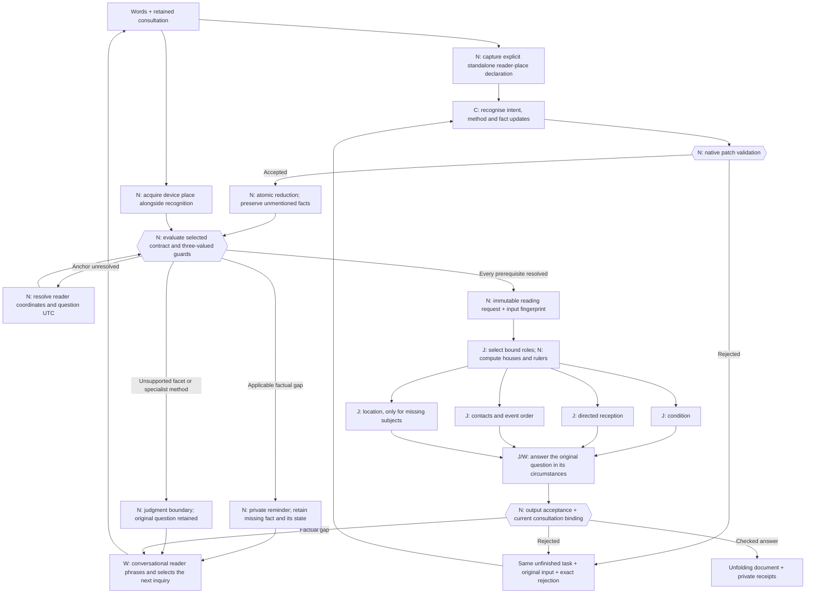

# Executable reading contracts

Generated by Rust from `reading_contracts.rs`. Version: `{VERSION}`. The catalogue generates the live recognition instructions and schema, selected reading instructions, private conditional reminders, readiness gate, and this reference. Edit the catalogue and regenerate; do not edit this generated document by hand.

There are two operations: **elicit information**, then **generate a reading**. Classification remains revisable. Recognition completes a fact patch; it cannot declare a consultation ready. A private Rust constructor evaluates the same requirements that prepare the reader’s private reminders.

**C** is classification/extraction; **J** is contextual horary judgment; **W** is writing; **N** is native computation or validation. Every reading worker can return a typed factual need instead of pretending to complete its work. Its response is checked before completion. All independent analysis responses are recorded before repair begins. The production batch holds up to four inference sequences sharing one model.

Known factual slots provide authored example questions to the conversational model. They never write directly into the conversation. A contextual detail discovered by a reading worker keeps that worker's specific, checked question in the same consultation. Both the question and its reason remain in the receipts. A worker cannot re-ask ownership or capacity already resolved in its handoff.

Facts can be **missing, proposed, resolved, conflicting, or unavailable**. Applicability is computed, never saved as N/A. An unknown guard asks for its controlling fact; it does not act as false. An unavailable required fact prevents a handoff and is acknowledged without repeatedly demanding an answer. A correction retains its previous observation in the change receipts and invalidates dependent interpretation. A contextual correction retains the chart anchor; an explicit anchor correction can recast it.

The reader's place and the question's understood moment are separate from an event's venue and start. Device acquisition is a real native operation, with failure receipts. A place or time explicitly supplied for an earlier chart must be resolved; it cannot silently fall back to device defaults. Civil clock gaps and overlaps return to the person for clarification.

A standalone “I'm asking from …” declaration supplies its place before text recognition, with an exact quote and a named native receipt. For direct audio, the same rule runs on the model's checked meaning summary; that summary still needs to accurately preserve the spoken place. The venue of a fair does not match that rule. An explicit “How many …” goal cannot be accepted as an event prediction. More ambiguous language still requires model recognition and, where necessary, clarification.

The same Gemma weights currently serve every program. The selected instruction card and frozen handoff vary. Inapplicable facts and background participants stay in the consultation but are omitted from a reading handoff. Stable teaching prefixes use the existing native lesson cache; no second model or Python environment is introduced.

Shape checks and source-span checks cannot certify semantic extraction or astrologically correct judgment. Authored tests establish controller behavior; real-model probes are separate evidence. `Implemented` means the native worksheet path is wired, not Eileen's approval or empirical prediction accuracy. `ExpertReview` cards elicit their specified inputs but explicitly block an unreviewed judgment. An exact sales count has no generic fallback.

Additional implemented-method boundaries are executable too: an unspecified money source needs a reviewed role, and a purchase/rental frame involving another title owner cannot silently use that owner's house as the buyer's frame. The private clipboard retains that limitation and the case; the conversational model explains it naturally. Numeric timing remains subject to the calculation boundary in the full process reference.

## Canonical records and boundaries

| Record | Authority | Behavior |
|---|---|---|
| `Turn` | Model proposal | Optional replacements, typed updates, exact quotes from current words or the retained original question; unmentioned facts stay untouched |
| `Consultation` | Native reducer | Original question, revisable frame, participants, subject, fact states, pending requirement, and change receipts |
| `Conversation` | Model, separate cached lesson | Replies to the person, chooses a native reminder ID; cannot mutate facts or declare readiness |
| `Plan` | Catalogue | Computed applicable gaps, private question examples, and named method limitations |
| `Anchor` | Native tools | Reader coordinates and question UTC, separate from story place/time |
| `ReadyReading` | Private Rust constructor | Applicable required facts, supported facet, implemented program, and fingerprint of the complete selected inputs; no public deserialization route |
| `ReadingResult` | Checked native boundary | Bound judgment, typed information need, or named limitation |

The [complete process reference](LLM_PROCESS.md) includes actual scheduler requests, prompts, analysis schemas, cache behavior and calculation limits. [The earlier elicitation design](ELICITATION_DESIGN.md) is the research record. The machine-readable [catalogue export](llm-process/reading-catalogue.json) is generated from these same Rust values.

## Contracts
